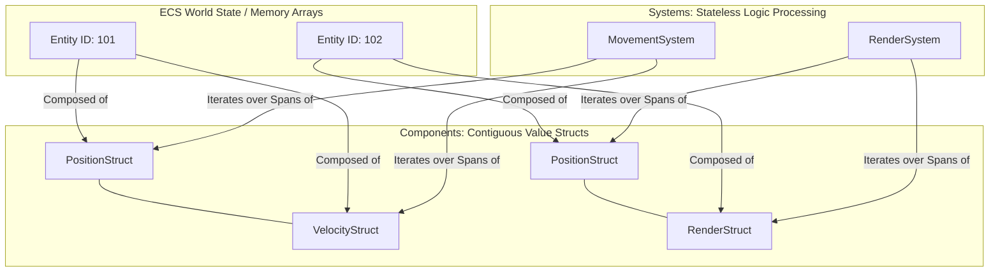

# Entity Component System (ECS) Architecture

Entity Component System (ECS) is a software architectural pattern used primarily in game development to store and iterate over high-volume game data. Unlike traditional Object-Oriented Programming (OOP) which relies on deep class inheritance and binds data and logic together, ECS favors **pure data composition** and segregates data cleanly from execution logic.

This design yields extreme hardware efficiency by enforcing data locality in memory, enabling highly parallel processing via multi-threading, and eradicating the maintenance bottlenecks of complex inheritance trees.

---

## The Three Pillars of ECS



### 1. The Entity

An entity is a simple, lightweight identifier (typically a 32-bit or 64-bit integer index). It contains absolutely no data, fields, or functions. It acts solely as a tracking anchor to bind multiple detached components together in space.

### 2. The Component

Components are pure, unmanaged value structures (`struct`). They hold data data-bags (like positions, statistics, or cooldown integers) but possess **zero behavioral logic, calculations, or functions**. To achieve maximum hardware speed, components must remain flat value types with no references to managed classes.

### 3. The System

Systems are completely stateless execution pipelines containing the logic and calculations of the game world. They perform actions globally across matching components. A system filters the registry to find specific combinations of components, maps them into linear windows, and updates them iteratively.

---

## The Performance Secret: Hardware Memory Alignment

In classic OOP, components or fields are created as `class` instances. This creates a scattered "Sea of Pointers" across the Managed Heap, triggering continuous CPU cache misses as the processor is forced to hop across disparate memory addresses.

ECS leverages C# modern memory tools like `struct`, `ref`/`in`, and `Span<T>` to arrange components in contiguous, sequential parallel blocks.

When a system loops over an array of pure structs, the CPU's prefetcher loads an entire segment of memory into the L1/L2 hardware cache simultaneously. The CPU encounters **zero cache misses** because every adjacent element sits physically side-by-side in raw hardware memory.

---

# Best Design Patterns for True High-Performance ECS

Traditional design patterns often depend heavily on class inheritance and virtual method tables (VMTs), which disrupt linear cache-line streaming. To maintain performance, design patterns must be re-engineered around pure value types, reference passing, and unmanaged collections.

## 1. Flyweight Pattern (Config-to-Component Reference)

* **Best For:** Stopping memory bloat and redundancy when managing thousands of dynamic entities that share heavy static configuration profiles (such as identical item icons, weapon base attributes, or mesh paths).
* **How It Works:** Component structures discard all strings and configuration references. They store an integer lookup index pointing to a singular read-only managed configuration object cached globally in memory.

```csharp
// Intrinsic Data: Configuration footprint loaded once from a JSON blueprint
public class WeaponDefinition 
{ 
    public string SpritePath { get; set; } 
    public float BaseCooldown { get; set; } 
}

// Extrinsic Data: Lightweight value structure packed contiguously inside ECS memory arrays
public struct WeaponComponent
{
    public int EntityId;
    public int DefinitionIndex; // Direct index pointer into the shared configuration asset array
    public float ActiveCooldownTimer;
}

```

## 2. Component Tag Pattern (The Branchless Alternative to State)

* **Best For:** Implementing structural state configurations or conditional behaviors without injecting branch logic transitions (`if/else` or `switch` blocks) inside hot loop iterations.
* **How It Works:** Instead of evaluating internal `enum` or state flags inside a loop, states are designated by **empty value structures (Tags)**. Systems use registry query filters to isolate matching component blocks into dedicated parallel slices, ensuring uninterrupted instructions across uniform value arrays.

```csharp
// Zero-sized tags used solely as structural query filters
public struct AggressiveStateTag {}
public struct EvadingStateTag {}

public class AggressiveMovementSystem
{
    // Processes a dense memory span containing ONLY components matching the AggressiveStateTag
    public void Update(Span<PositionComponent> positions, ReadOnlySpan<AggressiveStateTag> tags)
    {
        for (int i = 0; i < positions.Length; i++)
        {
            ref var pos = ref positions[i];
            pos.X += 1.5f; // Unbranched, continuous pipeline stream optimized for CPU execution
        }
    }
}

```

## 3. Observer Pattern (Reactive Ring Buffers / Dirty Flags)

* **Best For:** Synchronizing state data changes inside backend simulation memory with external display engines (like Godot scene trees or rendering viewports) without creating tight dependencies.
* **How It Works:** Attaching traditional standard C# events directly inside structs ruins value semantics and prevents contiguous alignment. Instead, components use bitwise flags ("dirty flags") or write structural transaction tokens into dedicated reactive ring buffers that visual layout systems parse and clear sequentially at the close of every frame cycle.

```csharp
public struct HealthComponent
{
    public int CurrentHP;
    public bool IsDirty; // Boolean status tracking flag read by viewport display managers
}

public class RenderObserverSystem
{
    public void SynchronizeViewports(ReadOnlySpan<HealthComponent> healthComponents, GodotHealthBarNode[] visualNodes)
    {
        for (int i = 0; i < healthComponents.Length; i++)
        {
            // The 'in' modifier reads data safely by reference, avoiding copy overhead
            in var health = ref healthComponents[i]; 
            if (health.IsDirty)
            {
                visualNodes[i].UpdateProgressBarValue(health.CurrentHP);
            }
        }
    }
}

```

## 4. Mediator Pattern (Unmanaged Event Channels)

* **Best For:** Establishing robust data pipelines between completely separate backend system controllers or job workers while avoiding references across logical boundaries.
* **How It Works:** Independent systems are strictly isolated from one another. When an execution event occurs (such as a structural impact or collision), a system logs transaction values inside a flat unmanaged queue managed by a central communications broker. Dependent processing systems fetch this transaction span sequentially, completing the data routine.

```csharp
public struct CollisionEvent
{
    public int SourceEntityId;
    public int TargetEntityId;
    public int ImpactForce;
}

public class CentralMessageMediator
{
    private CollisionEvent[] _eventBuffer = new CollisionEvent[512];
    private int _count = 0;

    public void PushEvent(in CollisionEvent evt) => _eventBuffer[_count++] = evt;

    public Span<CollisionEvent> DispatchChannels() => _eventBuffer.AsSpan(0, _count);
    public void Flush() => _count = 0;
}
// PhysicsSystem appends data into the mediator; the CombatDamageSystem drains the Span linearly!

```

---

# Architecture Paradigm Comparison

| Architectural Challenge | The Traditional OOP Approach | The Pure High-Performance ECS Approach |
| --- | --- | --- |
| **Data Composition** | Bound via class inheritance chains. | Assembled dynamically via modular structures. |
| **Memory Allocation** | Objects scattered across the Managed Heap. | Contiguous components packed inside sequential arrays. |
| **Logic Processing** | Virtual method routines inside separate objects. | Parallel loops updating value arrays via systems. |
| **State Alteration** | Complex conditional trees or structural class switches. | Dynamic insertion/removal of structural Tag components. |
