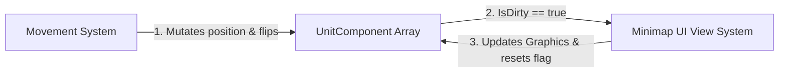
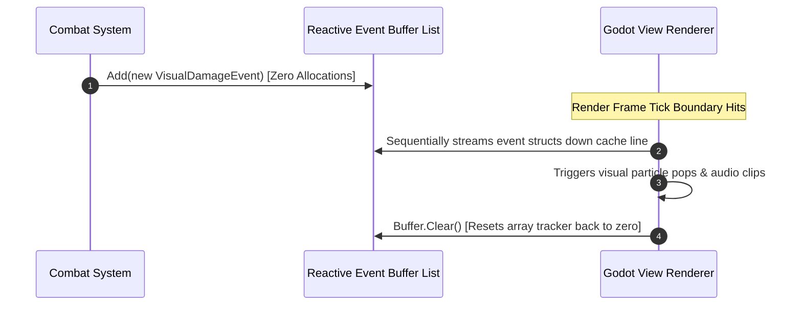
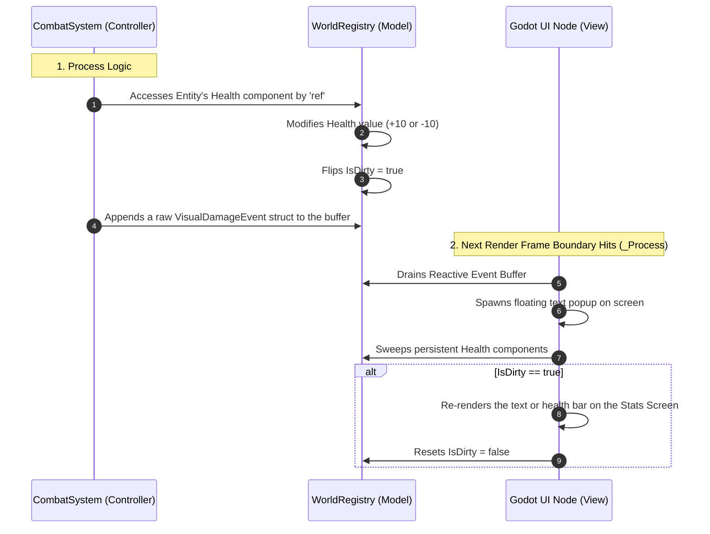

# Data-Oriented Event Handling in ECS

To understand how events fit into a high-performance Entity Component System (ECS), we must abandon traditional Object-Oriented Programming (OOP) patterns.

In traditional games, events are driven by a **Push Model** using direct callback links like C# delegates or Godot Signals (e.g., `onDeath`, `onTakeDamage`). Attaching managed delegate pointers or method references directly inside ECS components breaks your memory layout, causes massive garbage collection spikes, and creates tight engine coupling.

A mature, decoupled engine splits event handling into **three distinct, highly optimized pipelines**, each tailored to a specific class of data lifecycle problem:

1. **`IsDirty` Flags (State Persistence):** Polling flags embedded in long-lived component arrays.
2. **Reactive Event Buffers (Transient Spark):** Flat queues for frame-bound, one-shot feedback.
3. **Central Delegate Registries (System Routing):** Lookup tables to route data configurations to compiled code logic.

## 1. The `IsDirty` Bitmask (For Persistent State Persistence)

* **The Concept:** A simple primitive boolean or bit flag embedded directly inside your long-lived, continuous component structures.
* **Best Used For:** Persistent variables that live indefinitely in memory but change unpredictably (e.g., player health bars, unit world positions, minimap markers).
* **The Workflow:** The Controller mutates the data and flips the flag to `true`. At the end of the frame, the View sweeps the memory bank, processes *only* the data elements marked true, updates its on-screen nodes (like Godot Labels), and flushes the flag back to `false`.



#### C# Implementation

```csharp
namespace Game.Model
{
    // High-performance value type sitting contiguously in an array slot
    public struct HealthComponent
    {
        public int EntityId;
        public int CurrentHp;
        public bool IsDirty; // The gatekeeper tracking flag
    }

    public class HealthRegistry
    {
        private readonly HealthComponent[] _pool = new HealthComponent[1024];
        public ref HealthComponent GetModifiable(int id) => ref _pool[id];
        public Span<HealthComponent> GetSpan() => _pool.AsSpan();
    }
}

```

## 2. The Reactive Event Buffer (For Transient, One-Shot FX)

* **The Concept:** Instead of an active callback trigger, we push a temporary `struct` into a global array buffer. This is known as a **Frame Backlog**.
* **Best Used For:** Instantaneous, one-shot transactions that happen on a specific frame and leave behind no permanent data state (e.g., triggering a screen shake, spawning blood particles, or playing a slashing audio cue).
* **The Workflow:** Logic systems drop raw event records into a flat list throughout the frame. The View (Godot) iterates through this queue sequentially to trigger graphic effects, and then the controller wipes the list clear via `.Clear()`, dropping memory overhead to zero with no GC allocations.



#### C# Implementation

```csharp
namespace Game.Events
{
    // Pure unmanaged value type event notification
    public struct VisualDamageEvent
    {
        public int TargetEntityId;
        public int DamageAmount;
    }

    public class CombatSystem
    {
        // Pre-allocated frame event buffer array queue
        public List<VisualDamageEvent> FrameEvents { get; } = new(256);

        public void ApplyStrike(ref Model.HealthComponent target, int damage)
        {
            target.CurrentHp -= damage;
            target.IsDirty = true; // State persistence tracking

            // Transient Event Logging: Zero heap allocations!
            FrameEvents.Add(new VisualDamageEvent 
            { 
                TargetEntityId = target.EntityId, 
                DamageAmount = damage 
            });
        }
    }
}

```

## 3. The Central Delegate Table (For Decoupled System Routing)

* **The Concept:** A dictionary lookup map that links a data-driven text keyword directly to a high-performance compiled logic method pointer.
* **Best Used For:** Mapping external game asset attributes—like AI routine choices or skill types from `definitions.json` (e.g., `"GoToSleep"`, `"ApplyPoison"`)—to code execution pipelines.
* **The Workflow:** Systems query this database at runtime using data-driven asset strings, instantly resolving actions to compiled functions without heavy runtime conditional testing chains.

#### C# Implementation

```csharp
namespace Game.Ai
{
    using System;
    using System.Collections.Generic;

    public class AiRoutineSystem
    {
        // Maps an external configuration string to an executable code delegate method pointer
        private readonly Dictionary<string, Action<int>> _routingTable = new();
        private readonly Model.HealthRegistry _registry;

        public AiRoutineSystem(Model.HealthRegistry registry)
        {
            _registry = registry;
            
            // Registering decoupled structural functions as routing keys at engine boot
            _routingTable["GoToSleep"] = ExecuteSleepRoutine;
            _routingTable["FleeFromDanger"] = ExecuteFleeRoutine;
        }

        public void ExecuteAction(string keyword, int entityId)
        {
            if (_routingTable.TryGetValue(keyword, out var routine))
            {
                routine.Invoke(entityId); // Executes instantly with zero string parsing evaluations
            }
        }

        private void ExecuteSleepRoutine(int entityId)
        {
            ref var health = ref _registry.GetModifiable(entityId);
            health.CurrentHp += 10;
            health.IsDirty = true;
        }

        private void ExecuteFleeRoutine(int entityId) { /* Movement logic... */ }
    }
}

```

## The Combined Engine Loop Lifecycle

To see how these 3 systems mesh together without fighting, look at the sequence of a single live game loop frame processing inside **Godot's presentation ecosystem**:

```csharp
using Godot;
using System;
using Game.Model;
using Game.Events;
using Game.Ai;

public partial class GameViewFrameDriver : Node2D
{
    private HealthRegistry _registry;
    private CombatSystem _combatSystem;
    private AiRoutineSystem _aiSystem;

    public override void _Ready()
    {
        // 1. Boot up pure decoupled C# backend architecture structures
        _registry = new HealthRegistry();
        _combatSystem = new CombatSystem();
        _aiSystem = new AiRoutineSystem(_registry);
    }

    // RUNS CONTINUOUSLY EVERY FRAME
    public override void _Process(double delta)
    {
        // STEP A: RUN CONTROLLER SIMULATION LOGIC
        // Let's pretend an enemy script commands Entity 42 to use its AI routine
        _aiSystem.ExecuteAction("GoToSleep", 42); 

        // Let's pretend an event causes player combat damage to land this frame
        ref var playerHealth = ref _registry.GetModifiable(0);
        _combatSystem.ApplyStrike(ref playerHealth, 15);


        // STEP B: CONSUME TRANSIENT EVENT BUFFERS (JUICE & SPECIAL FX)
        ReadOnlySpan<VisualDamageEvent> events = _combatSystem.FrameEvents.ToArray();
        for (int i = 0; i < events.Length; i++)
        {
            in var evt = ref events[i];
            
            // Triggers immediate, volatile, frame-bound feedback outputs safely
            SpawnFloatingCombatText(evt.TargetEntityId, $"-{evt.DamageAmount} HP");
            PlaySoundEffect("res://audio/hit.wav");
        }
        _combatSystem.FrameEvents.Clear(); // Flush transient buffers to zero footprint!


        // STEP C: POLL PERSISTENT STATE DATA (UI SYNCHRONIZATION)
        Span<HealthComponent> healthComponents = _registry.GetSpan();
        for (int i = 0; i < healthComponents.Length; i++)
        {
            ref var health = ref healthComponents[i];
            
            // Fast branchless skip: The CPU sweeps by unchanged units instantly!
            if (!health.IsDirty) 
                continue;

            // Heavy UI modifications fire ONLY for modified data states
            Label hpLabel = GetNode<Label>($"UI/Unit_{health.EntityId}/HpText");
            hpLabel.Text = $"HP: {health.CurrentHp}";

            health.IsDirty = false; // Reset the persistent tracker flag
        }
    }

    private void SpawnFloatingCombatText(int id, string text) { /* Godot visual node pop */ }
    private void PlaySoundEffect(string path) { /* Godot audio element */ }
}

```

### Production Summary Strategy

| Event Architecture Axis | Primary Responsibility | Data Storage Context | Data Lifespan |
| --- | --- | --- | --- |
| **1. `IsDirty` Flags** | Syncing permanent UI text displays, map coordinates, and persistent graphics nodes. | Packed inside the component data struct array layout. | **Persistent** (Lives until entity is removed). |
| **2. Reactive Buffers** | Triggering temporal audio assets, particle emissions, screen shake, and floating text pops. | Pre-allocated global context frame lists. | **Transient** (Wiped clean at the end of each frame). |
| **3. Delegate Tables** | Directing action strings from `definitions.json` directly to high-speed logic methods. | Immutably stored inside the System Bootstrapper context registry. | **Static** (Set once at engine initialization). |

## When to use each one

Here is an extended, practical production guide detailing exactly when to deploy each of the three ECS event pipelines during game development.

### 1. When to Use: `IsDirty` Bitmask Flags

**Rule of Thumb:** Use this when a value represents a long-term **state** of an entity, and a visual system needs to continuously mirror that state on screen without wasting CPU power recalculating things that haven't changed.

**User Interface (UI) Data Synchronization:**
* Updating progress bars, numeric readouts, and sliders (e.g., Health bars, Mana reserves, Shield capacity, Level-up XP bars, Ammo counters).
* Refreshing inventory grids only when an item is added, moved, or consumed.


**Transform & Positioning Maps:**
* Synchronizing 2D/3D visual graphics nodes with your background physics simulation positions.
* Updating unit locations on a strategic Minimap or World Map.
* Recalculating field-of-view (Fog of War) outlines only when an entity physically crosses a tile boundary.


**Static & Dynamic Attribute Changes:**
* Recalculating total combat stats (e.g., Attack Power, Crit Chance) only when armor is modified or a permanent buff is applied.
* Changing the visible state of an environmental object (e.g., opening/closing a door, turning a light grid source on/off).


**Networking & Replication:**
* Flagging data values that need to be packaged and synced over the network to client machines during the next server replication cycle.


### 2. When to Use: Reactive Event Buffers

**Rule of Thumb:** Use this when an occurrence is a one-shot, instantaneous **transaction** that happens on a specific frame, leaves behind no permanent state data, and requires immediate visual or auditory feedback.

**Combat Feedback & "Juice":**
* Spawning floating text pops (e.g., critical hit numbers, "+10 XP", "Miss!").
* Triggering screen shake, gamepad vibration, or camera flashes when an explosion or heavy impact occurs.
* Spawning transient particle effects (e.g., blood splatters, muzzle flashes, dust clouds on a landing jump).


**Audio Orchestration:**
* Firing specific sound clips at the correct screen coordinates (e.g., footsteps, sword clangs, weapon reloads, ambient breaking glass).


**Lifecycle Disposals & State Transitions:**
* Handling Entity Death (e.g., alerting a loot drop system to spawn items at coordinates, playing a death animation, or updating a quest kill tracker).
* Tracking specific milestones achieved during a single frame (e.g., "Quest Completed", "Level Up!" flash animations).


**Transaction Logs & Narrative Analytics:**
* Passing a log of what happened to an on-screen scrolling text log window (e.g., *"Goblin deals 12 damage to Hero"*).


### 3. When to Use: The Central Delegate Routing Table

**Rule of Thumb:** Use this at initialization time to bind data configuration files directly to structural logic systems, avoiding massive, nested `switch-case` branches and hardcoded logic pathways.

**Data-Driven AI Routine Behavior Parsing:**
* Mapping action string keywords from an NPC schedule file (e.g., `"PatrolSector"`, `"GoToSleep"`, `"FleeToSafety"`) directly to their compiled backend execution methods.


**Item & Skill Modification Engines:**
* Routing unique functional triggers for usable inventory items (e.g., an item file specifies `"UseEffect": "TriggerHeal"` or `"UseEffect": "ApplyPoison"`).
* Executing modular magic spell effects from a spell dictionary data asset.


**Environmental Interaction Mapping:**
* Handling player interaction scripts with distinct puzzle objects (e.g., an object file links a physical lever to `"ActivateBridge"`, `"OpenVault"`, or `"TriggerTrap"` routines).


**Console Commands & Cheat Intakes:**
* Binding terminal text inputs parsed from an in-game developer debug console (e.g., `/godmode`, `/spawn_enemy`, `/noclip`) directly to internal management routines.


### Summary Cheat Sheet: Architectural Filter Matrix

When implementing a new feature, ask your team these two diagnostic questions to choose the correct layout pipeline instantly:

```
                  Is it a permanent value or a transient spark?
                                |
        +-----------------------+-----------------------+
        |                                               |
  [ Permanent Value ]                             [ Transient Spark ]
        |                                               |
 Does it exist in memory?                 Is it driven by data strings?
        |                                               |
  +-----+-----+                                   +-----+-----+
  |           |                                   |           |
(Yes)        (No)                               (Yes)        (No)
  |           |                                   |           |
  v           v                                   v           v
IsDirty    (Not an                             Delegate    Reactive
Flag       ECS Event)                          Registry    Buffer

```

## Example

In this example, an entity receives a 10 Hit Points.

When an entity receives **10 HP** (either taking 10 damage or gaining 10 healing), your engine processes this using both the **`IsDirty` Flag pipeline** and the **Reactive Event Buffer pipeline** simultaneously.

The process moves sequentially down a clean pipeline across your layers:

### The Dynamic Data Flow



### Step 1: Updating the Health Value (Model Layer)

Your logic system (Controller) mutates the raw numbers inside the model registry. It **never** talks to Godot UI objects. Instead, it updates the data in place and leaves tracking signals for the View:

```csharp
// Inside your pure C# CombatSystem
public void AdjustHealth(int entityId, int amount)
{
    // 1. Get a direct memory reference to the entity's struct
    ref var health = ref _registry.GetModifiable(entityId);

    // 2. Mutate the health value directly in memory
    health.CurrentHp += amount;

    // 3. Mark it as dirty so the Stats Screen knows a change occurred
    health.IsDirty = true;

    // 4. Record a transient event for instant juice/FX (like floating combat text)
    _combatSystem.FrameEvents.Add(new VisualDamageEvent 
    { 
        TargetEntityId = entityId, 
        DamageAmount = amount 
    });
}

```

### Step 2: Updating the Health Stats Screen (View Layer)

At the end of the execution frame, Godot triggers its graphics tick (`_Process`). The stateless View system monitors the flags left behind by the model:

#### Phase A: Spawns One-Shot Visual Feedback (Reactive Buffer)

The View looks at the temporary event buffer to create frame-bound special effects. It streams the list, spawns a text pop-up at the entity's coordinates, and completely clears the buffer:

```csharp
// Inside Godot View's _Process loop
foreach (var evt in _combatSystem.FrameEvents)
{
    // Spawns a physical floating number node in Godot (+10 or -10)
    SpawnFloatingTextPopUp(evt.TargetEntityId, evt.DamageAmount); 
}
_combatSystem.FrameEvents.Clear(); // Emptied immediately

```

#### Phase B: Redraws the Persistent Stats Screen Layout (`IsDirty`)

Next, the View reads your main health array. Instead of spending costly CPU cycles translating integers to strings every single frame for every entity on screen, it checks the boolean flag:

```csharp
// Inside Godot View's _Process loop
Span<HealthComponent> components = _registry.GetSpan();
for (int i = 0; i < components.Length; i++)
{
    ref var health = ref components[i];

    // FAST SKIP: If the entity didn't gain/lose HP, the CPU skips this instantly!
    if (!health.IsDirty) 
        continue;

    // UPDATE SCREEN: Only runs for entities whose health actually shifted this frame
    Label hpStatsTextLabel = GetNode<Label>($"UI/StatsScreen/Unit_{health.EntityId}/HpValue");
    hpStatsTextLabel.Text = $"{health.CurrentHp} HP";

    // CLEANUP: Reset the flag so it won't redraw next frame unless changed again
    health.IsDirty = false;
}

```

### Why this split works beautifully

If your character stands perfectly still for an hour, their health value remains untouched in memory, the event list stays at `0`, and Godot bypasses any layout redraw logic entirely—keeping your UI processing cost at zero. The moment a `10 HP` modification lands, your simulation registers the update at lightning speed, and your View effortlessly polls the data to reflect it perfectly on screen exactly when needed.
