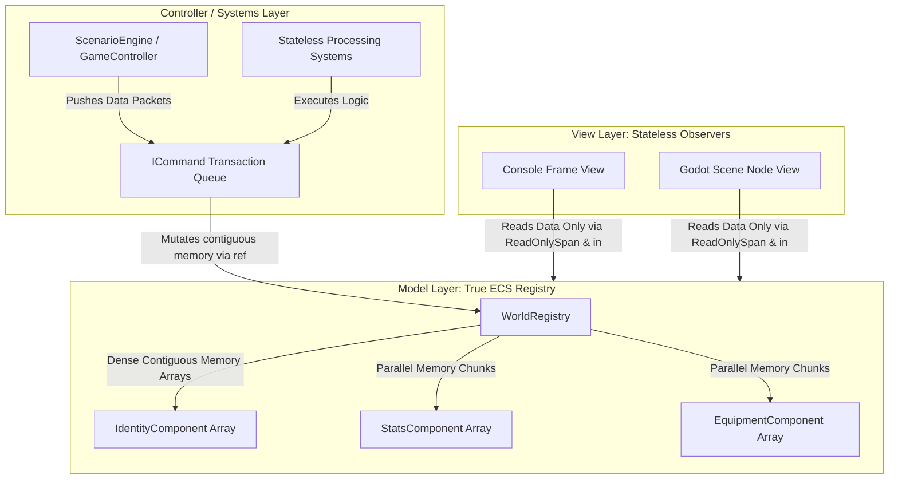
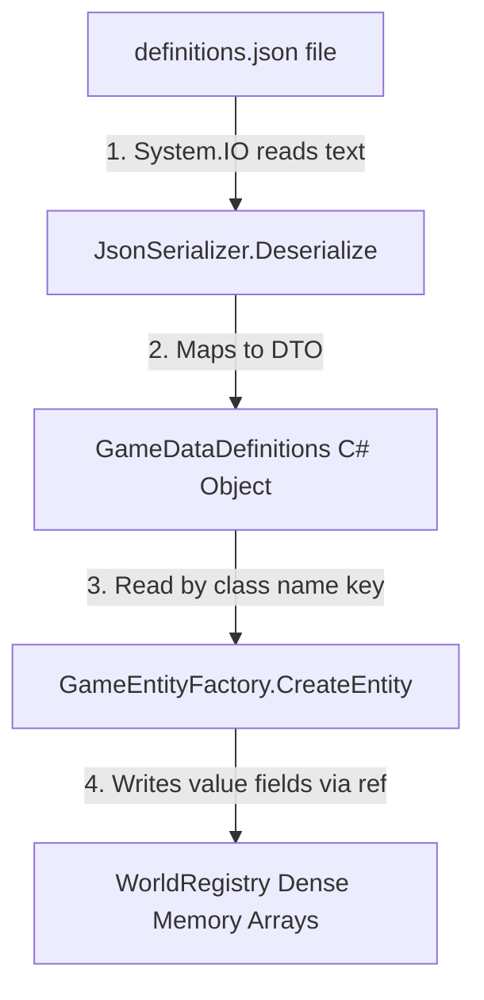
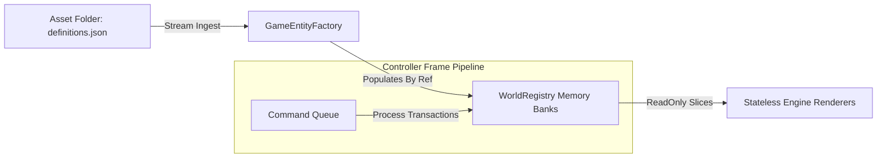

# ECS, MVC, Data-Driven, and Design Patterns

# Architectural Patterns & Core Principles

By separating your core simulation logic from any specific game engine (like Godot), you can build a clean, modular, and professional codebase. Here is how your architectural paradigms fit together when mapping Model-View-Controller (MVC) over a high-performance Entity Component System (ECS):



## 1. Entity Component System (ECS) & Composition

Instead of building deep, fragile Object-Oriented inheritance trees (e.g., `Monk` inherits from `Character` inherits from `Agent` inherits from `PhysicsBody`), this architecture relies on **Pure Data Composition** optimized for hardware performance.

### Core Concepts of your ECS

* **The Entity:** A lightweight identifier (a simple `int` or `Guid`). It has no data or behavior; it acts strictly as an array index anchor to tie detached data blocks together.
* **The Component:** Pure unmanaged value types (`struct`). They hold layout variables (integers, floats, booleans) but contain **zero methods or behavioral logic**.
* **The System:** Completely stateless classes containing the calculations and rules of your world. Systems query matching components as continuous blocks of memory to iterate through them at maximum hardware speed.

## 2. Model-View-Controller (MVC) Alignment

The integration of ECS into an MVC setup demands strict boundaries to protect the data layer:

* **The Model (Data):** The `WorldRegistry` hosting dense, sequential arrays of raw component structs. It holds structural numbers but has no concept of loops or graphics.
* **The Controller (Logic):** The `GameController`, stateless simulation systems, and `ICommand` transaction buffers. They schedule time frames, calculate statistics, and modify the Model.
* **The View (Presentation):** Stateless systems (like `RenderObserverSystem`) that translate internal data changes into viewport adjustments. The View reads data passively via fast reference semantics (`in` and `ReadOnlySpan<T>`) without modifying values or allocating memory.

## 3. Data-Driven Foundation

Hardcoding structural game variables within C# source files produces rigid code. By using a data-driven structure, archetypes are defined entirely inside external configuration files (like `definitions.json`). At boot time, the engine reads these structures and feeds them directly into an **Abstract Factory**, which populates the dense component matrices of the Model layer.

---

# Design Patterns Applied to MVC & ECS

To keep these layers decoupled without destroying memory performance, we rely on targeted design patterns re-engineered for unmanaged value tracking.

### 1. Abstract Factory Pattern (Creational)

* **The Boundary:** Controller $\rightarrow$ Model
* **The Problem:** The world generation setup needs to populate the world from a JSON configuration file. Instantiating concrete object references directly inside loading scripts couples the system to a single runtime setup.
* **The Solution:** The engine calls an abstract interface contract (`IEntityFactory`). By injecting a different factory implementation, you can switch from building minimal data blocks for headless server unit tests to initializing full engine scene states without changing your core generation rules.

### 2. Command Pattern (Behavioral)

* **The Boundary:** Controller $\rightarrow$ Model Mutation
* **The Problem:** Having systems or input elements invoke structural transformations directly causes code dependencies and messy switch-case branching statements.
* **The Solution:** Actions (like moves or attacks) are packaged into standalone, lightweight transactional data structures. The controller manages these inside flat queues, allowing actions to be intercepted, fast-forwarded during history timeline generations, or safely scheduled across parallel worker threads.

### 3. Flyweight Pattern (Structural)

* **The Boundary:** Model Data Storage
* **The Problem:** If thousands of active entities copy identical configuration data (like base statistics, name strings, or sprite file pathways) into their components, memory consumption bloats, clearing out the CPU's hardware cache lines.
* **The Solution:** Component structures drop heavy reference allocations. They hold a single integer lookup identifier that targets a master configuration array loaded once from the JSON file.

### 4. Observer Pattern via Tracking Flags (Behavioral)

* **The Boundary:** Model $\rightarrow$ View Synchronicity
* **The Problem:** Traditional C# events use heavy delegate pointers. If attached inside a component struct, they break its value semantics and cause memory fragmentation.
* **The Solution:** Components feature a simple boolean flag (`IsDirty`). The View systems filter these bits at the end of an execution frame, reading the values to refresh graphic progressive bars or UI node states with zero allocation overhead.

---

# Complete Architectural Refactoring

Below is the complete, high-performance implementation of this architecture in C#, utilizing `struct`, `ref`, `in`, and `Span<T>` to maintain continuous data locality and eliminate cache misses.

To make the architecture entirely complete, the exact data layout for `definitions.json` must match the data transfer objects (`GameDataDefinitions` and `ClassDefinition`) expected by the C# deserializer.

Here is the file structure that bridges the data-driven configuration file directly to your memory arrays:

### File: `definitions.json`

```json
{
  "Classes": {
    "Hero": {
      "BaseHealth": 100,
      "BaseMana": 50,
      "BaseDamage": 15
    },
    "Goblin": {
      "BaseHealth": 30,
      "BaseMana": 0,
      "BaseDamage": 6
    }
  }
}

```

### How the Data Flows From JSON to Memory Arrays

When the application boots, the JSON structure above maps directly through the C# system layer like this:



1. **`definitions.json`**: Contains your structural configuration data, separated from the compiled executable.
2. **`DataTransferObjects.cs`**: Provides strong-typed contracts (`GameDataDefinitions`) to temporarily hold the data in memory immediately after parsing.
3. **`GameEntityFactory.cs`**: Looks up the class name inside the parsed dictionary (e.g., `"Hero"`), extracts the raw integer numbers, grabs a fresh index from the registry, and copies those values directly into the physical `struct` array slot using `ref`.

Once the step is done, the initial temporary JSON objects can be safely garbage collected, while your game loops operate purely on flat, fast, contiguous hardware caches.


### File: `Components.cs` (The Pure Value Model Layer)

```csharp
using System;

namespace RpgCore.Model
{
    // High-performance value types stored contiguously in memory arrays
    public struct IdentityComponent 
    {
        public int EntityId;
        public int DefinitionIndex; // Flyweight pointer targeting the master JSON definition array
    }

    public struct StatsComponent 
    {
        public int EntityId;
        public int Health;
        public int Mana;
        public int PositionX;
        public int PositionY;
        public bool IsDirty; // Structural flag monitored by reactive Viewport observers
    }

    public struct EquipmentComponent 
    {
        public int EntityId;
        public int Damage;
    }
}

```

### File: `DataTransferObjects.cs` (External Blueprint Data Configurations)

```csharp
using System.Collections.Generic;

namespace RpgCore.Data
{
    public class GameDataDefinitions
    {
        public Dictionary<string, ClassDefinition> Classes { get; set; } = new();
    }

    public class ClassDefinition
    {
        public int BaseHealth { get; set; }
        public int BaseMana { get; set; }
        public int BaseDamage { get; set; }
    }
}

```

### File: `WorldRegistry.cs` (Contiguous Parallel Array Memory)

```csharp
using System;
using RpgCore.Model;

namespace RpgCore.Model
{
    public class WorldRegistry
    {
        // Dense sequential memory buffers optimized for CPU prefetching
        private readonly StatsComponent[] _statsArrays = new StatsComponent[1024];
        private readonly EquipmentComponent[] _equipmentArrays = new EquipmentComponent[1024];
        private int _nextId = 0;

        public int AllocateNewEntityId() => _nextId++;

        // Exposes elements by reference to modify memory slots in-place without copying
        public ref StatsComponent GetStatsModifiable(int id) => ref _statsArrays[id];
        public ref EquipmentComponent GetEquipmentModifiable(int id) => ref _equipmentArrays[id];

        // Exposes element with read-only semantics for maximum lookup speed
        public in EquipmentComponent GetEquipmentReadOnly(int id) => ref _equipmentArrays[id];

        // Provides a continuous hardware window slice for ultra-fast system sweeps
        public Span<StatsComponent> GetStatsSpan() => _statsArrays.AsSpan(0, _nextId);
    }
}

```

### File: `IEntityFactory.cs` & `GameEntityFactory.cs` (Creational Layer)

```csharp
using System;
using System.IO;
using System.Text.Json;
using RpgCore.Model;
using RpgCore.Data;

namespace RpgCore.Factories
{
    public interface IEntityFactory
    {
        int CreateEntity(string className);
    }

    public class GameEntityFactory : IEntityFactory
    {
        private readonly GameDataDefinitions _definitions;
        private readonly WorldRegistry _registry;

        public GameEntityFactory(string jsonFilePath, WorldRegistry registry)
        {
            string jsonString = File.ReadAllText(jsonFilePath);
            _definitions = JsonSerializer.Deserialize<GameDataDefinitions>(jsonString, 
                new JsonSerializerOptions { PropertyNameCaseInsensitive = true }) ?? new GameDataDefinitions();
            _registry = registry;
        }

        public int CreateEntity(string className)
        {
            if (!_definitions.Classes.TryGetValue(className, out var classDef))
                throw new ArgumentException($"Data Blueprint Class '{className}' not discovered.");

            // Factory returns a flat tracking index while appending values directly into dense arrays
            int entityId = _registry.AllocateNewEntityId();

            ref var stats = ref _registry.GetStatsModifiable(entityId);
            stats.EntityId = entityId;
            stats.Health = classDef.BaseHealth;
            stats.Mana = classDef.BaseMana;
            stats.IsDirty = true;

            ref var equip = ref _registry.GetEquipmentModifiable(entityId);
            equip.EntityId = entityId;
            equip.Damage = classDef.BaseDamage;

            return entityId;
        }
    }
}

```

### File: `Commands.cs` (Transactional Controller Pipelines)

```csharp
using System;
using RpgCore.Model;

namespace RpgCore.Commands
{
    public interface ICommand
    {
        void Execute(WorldRegistry registry);
    }

    public struct MoveCommand : ICommand
    {
        private readonly int _entityId;
        private readonly int _deltaX;
        private readonly int _deltaY;

        public MoveCommand(int entityId, int deltaX, int deltaY)
        {
            _entityId = entityId;
            _deltaX = deltaX;
            _deltaY = deltaY;
        }

        public void Execute(WorldRegistry registry)
        {
            // Mutates raw values inside their pre-allocated slots using reference pointers
            ref var stats = ref registry.GetStatsModifiable(_entityId);
            stats.PositionX += _deltaX;
            stats.PositionY += _deltaY;
            stats.IsDirty = true; // Alerts observer systems that updates are pending
        }
    }

    public struct AttackCommand : ICommand
    {
        private readonly int _attackerId;
        private readonly int _targetId;

        public AttackCommand(int attackerId, int targetId)
        {
            _attackerId = attackerId;
            _targetId = targetId;
        }

        public void Execute(WorldRegistry registry)
        {
            in var attackerEquip = ref registry.GetEquipmentReadOnly(_attackerId);
            ref var targetStats = ref registry.GetStatsModifiable(_targetId);

            targetStats.Health -= attackerEquip.Damage;
            targetStats.IsDirty = true;
        }
    }
}

```

### File: `Views.cs` (The Stateless View Layer)

```csharp
using System;
using RpgCore.Model;

namespace RpgCore.Views
{
    public class ConsoleGameView
    {
        // Processes continuous memory windows using read-only structures with no stack allocation copies
        public void RenderFrameUpdates(ReadOnlySpan<StatsComponent> statsSlices)
        {
            for (int i = 0; i < statsSlices.Length; i++)
            {
                in var stats = ref statsSlices[i];
                if (stats.IsDirty)
                {
                    Console.WriteLine($"[Render View] Entity ID: {stats.EntityId} shifted to ({stats.PositionX}, {stats.PositionY}) | Health: {stats.Health}");
                }
            }
        }

        public void FlushDirtyFlags(Span<StatsComponent> statsSlices)
        {
            for (int i = 0; i < statsSlices.Length; i++)
            {
                statsSlices[i].IsDirty = false;
            }
        }
    }
}

```

### File: `GameController.cs` (Central Control System)

```csharp
using System.Collections.Generic;
using RpgCore.Commands;
using RpgCore.Model;

namespace RpgCore.Controllers
{
    public class GameController
    {
        private readonly Queue<ICommand> _commandQueue = new();
        public WorldRegistry Registry { get; } = new();

        public void EnqueueCommand(ICommand command) => _commandQueue.Enqueue(command);

        public void ProcessPipelineFrame()
        {
            while (_commandQueue.Count > 0)
            {
                var command = _commandQueue.Dequeue();
                command.Execute(Registry);
            }
        }
    }
}

```

### File: `Program.cs` (Application Driver)

```csharp
using System;
using RpgCore.Controllers;
using RpgCore.Factories;
using RpgCore.Commands;
using RpgCore.Views;

public class Program
{
    public static void Main()
    {
        Console.WriteLine("=== Commencing High-Performance ECS / MVC Simulation ===");

        // 1. Initialize the Core Ecosystem Components
        var controller = new GameController();
        var view = new ConsoleGameView();

        // 2. Point the abstract factory to the physical asset on disk
        // The engine reads this asset once at boot time to drive configuration logic
        var factory = new GameEntityFactory("definitions.json", controller.Registry);

        // 3. Assemble dynamic entities into flat unmanaged memory slots via data blueprints
        int playerEntity = factory.CreateEntity("Hero");
        int enemyEntity = factory.CreateEntity("Goblin");

        // 4. Queue real-time operational commands into the simulation timeline
        controller.EnqueueCommand(new MoveCommand(playerEntity, 5, -2));
        controller.EnqueueCommand(new AttackCommand(playerEntity, enemyEntity));

        // 5. Run the transaction queue execution frame
        controller.ProcessPipelineFrame();

        // 6. Update the stateless Presentation View layer 
        var statsWindow = controller.Registry.GetStatsSpan();
        view.RenderFrameUpdates(statsWindow);
        view.FlushDirtyFlags(statsWindow);

        Console.WriteLine("=======================================================");
    }
}
```

### The Architectural Blueprint

Now that the file handles raw disk input directly, the streaming sequence strictly follows these operational lanes:



* **No String Interceptions:** The data stream directly converts characters from your asset disk space straight into primitive fields inside the factory cache.
* **Separation of Concerns:** If a game designer edits `definitions.json` to change the Goblin's `BaseHealth` to `50`, the compiled codebase is completely untouched. The engine loads the adjusted parameters on the next frame cycle, initializing the structural value components with zero friction.
