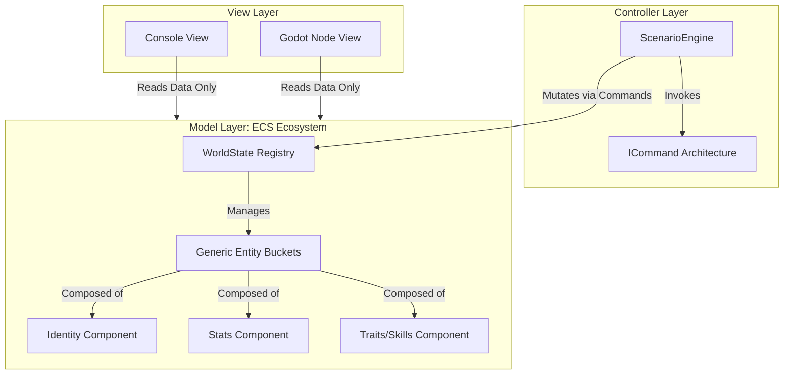
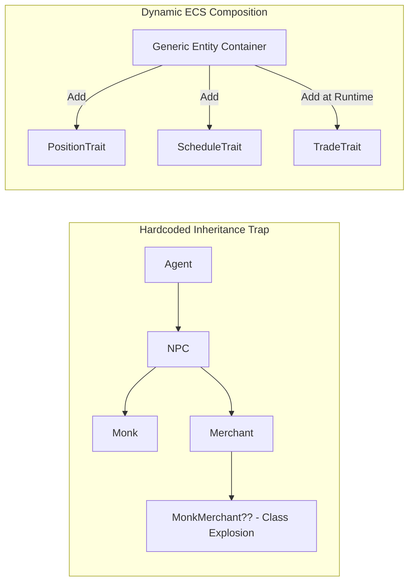
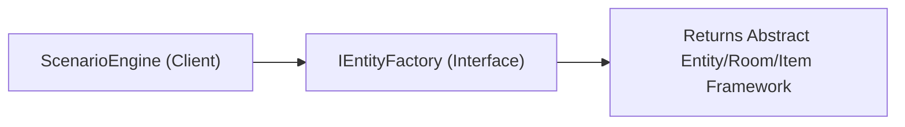

# ECS, MVC, Data Driven and Design Patterns

# Architectural Patterns & Core Principles

By separating your core simulation logic from any specific game engine (like Godot), you can build a clean, modular, and professional codebase. Here is how your architectural paradigms fit together:



## 1. Entity Component System (ECS) & Composition

Instead of building deep, fragile Object-Oriented inheritance trees (e.g., `Monk` inherits from `Character` inherits from `Agent` inherits from `PhysicsBody`), this architecture relies on **Pure Data Composition**.

### Core Concepts of your ECS

* **The Entity:** A lightweight, generic container stripped of all inherent behavior. It functions essentially as a tracking ID bucket.
* **The Component/Trait:** Pure data bags containing variables, IDs, coordinates, lists, or strings. They possess absolutely zero behavioral logic, system loops, or rendering instructions.
* **Dynamic Mutation:** States, roles, and behaviors can be injected into or stripped away from entities completely at runtime without breaking underlying class definitions.

### The Anatomy of Composition vs. Inheritance

A traditional inheritance model rigidly binds an object's capabilities at compile-time. If an automated routine requires a character to become a merchant, an inheritance model breaks down. The ECS ecosystem solves this seamlessly:



### Why the ECS Structure is Superior

Most indie games tie data, logic, and rendering into one single messy knot within engine scripts. By treating entities as raw data matrices managed via optimized collections, your simulation layer remains highly performant, fully moddable, and capable of simulating a deep, living clockwork world completely independent of visual frames.

## 2. Model-View-Controller (MVC)

Your system maintains a strict separation of concerns between your data, your logic, and your display boundaries:

* **The Model:** Handled entirely by your **ECS Ecosystem** (`WorldState`, `Entity`, and all raw data components). They store values but contain zero operational calculations or engine rendering loops.
* **The Controller:** Managed by the `ScenarioEngine`, `SimulationController`, and your `ICommand` processing pipelines. They evaluate variables, calculate simulation weights, tick the timeline forward, and mutate the components within the Model.
* **The View:** Your active rendering layer. This starts as a lightweight console rendering system but can be smoothly swapped for **Godot Nodes** (Sprites, Tilemaps, and UI elements). The View only reads structural states from the Model to render them; it is strictly prohibited from mutating data directly.

## 3. Data-Driven Entities

The codebase strictly separates structural game configuration from compilation logic.

* The structural matrix of your game world—the room layouts, item types, class parameters, and starter skills—is defined entirely outside your code files in configuration blueprints like `definitions.json`.
* Your C# core logic doesn't care if it's building a medieval monastery or a sci-fi lunar base; it simply ingests the data models at run-time, passing them to factories to populate your ECS containers dynamically.

# Design Patterns

## 1. Abstract Factory Pattern (Designing for Change)

> **Design Axiom:** Avoid creating an object by specifying a class explicitly. Specifying a class name when you create an object commits you to a particular implementation instead of a particular interface. This commitment can complicate future changes. To avoid it, create objects indirectly.

### The Anatomy of your Abstract Factory

The **Abstract Factory Pattern** decouples your core game systems from concrete instantiation keywords (`new`), splitting creation into two parts:

1. **The Abstract Interface:** Specifies what *can* be built, refusing to declare concrete class constraints.
2. **The Client (`ScenarioEngine`):** Demands an abstract factory implementation via constructor injection, preventing the engine from hardcoding dependencies.



#### The Abstract Interface Blueprint

```csharp
public interface IEntityFactory 
{
    NPC CreateNPC(string name);
    Room CreateRoom(string type);
    Item CreateItem(string name);
}

```

#### Avoid the Explicit Class Trap

Look at how a poor design breaks flexibility by tightly coupling the engine loop to a local console implementation:

```csharp
// BAD DESIGN: Hardcoding 'new Room()' chains this engine permanently to a Console app
public class BadScenarioEngine 
{
    public WorldState Generate() 
    {
        var state = new WorldState();
        foreach (var rt in _defs.RoomTypes) 
        {
            Room consoleRoom = new Room(rt.Type); // TRAP!
            state.Locations.Add(consoleRoom);
        }
        return state;
    }
}

```

### The Big Payoff: Migrating to Game Engines (Godot)

Because your production engine talks exclusively to an abstraction, migrating from a text application to a live graphical rendering pipeline requires **zero changes** to your simulation loops. You simply swap the underlying concrete factory implementation:

```csharp
// For Console Development
public class CoreEntityFactory : IEntityFactory
{
    public Room CreateRoom(string type) => new ConsoleDataRoom(type);
}

// For Live Godot Deployment
public class GodotNodeFactory : IEntityFactory
{
    // Spawns a real Godot PackedScene/Node3D under the hood!
    public Room CreateRoom(string type) => new GodotRoomNode(type); 
}

```

## 2. Command Pattern (Avoiding Hard-Coded Requests)

> **Design Axiom:** Avoid hard-coded requests. Dependence on specific operations commits you to one way of satisfying a request. By avoiding hard-coded requests, you make it easier to change the way a request gets satisfied both at compile-time and at run-time.

Instead of making hard-coded operational calls directly on your ECS entities or components, every state mutation, timeline track, and narrative shift is encapsulated into a standalone action capsule implementing an **`ICommand`** interface.

```csharp
public interface ICommand
{
    void Execute(WorldState state);
}

```

### Eliminating Compile-Time Hardcoding

A fragile implementation forces the core loop to know the explicit, specialized internal methods of every single entity type:

```csharp
// BAD DESIGN: Rigid compile-time dependence on specific methods
if (currentTime == model.CrimeTime)
{
    killer.Stab(victim);         // Fragile method dependency 1
    innocentMonk.GoToSleep();     // Fragile method dependency 2
}

```

Your architecture eliminates this entirely. The timeline executor evaluates a uniform collection of polymorphic commands without knowing their underlying execution rules:

```csharp
// YOUR DESIGN: Zero dependence on specific operations!
var commandQueue = new List<ICommand>();

queue.Add(new ExecuteMurderCommand(killer, victim, scene, currentTime));
queue.Add(new PerformAttendMassCommand(npc, targetRoom, currentTime, liturgy));

foreach (var command in commandQueue)
{
    command.Execute(model); // The engine is completely blind to the internal logic!
}

```

### Dynamic Run-Time Flexibility

Because behaviors are encapsulated in isolated command objects, your systems can intercept, clear, override, or inject commands dynamically based on environmental changes (e.g., clearing an NPC's routine commands to inject an emergency evacuation command if a fire event occurs).

## 3. Programming to an Interface, Not an Implementation

> **Design Axiom:** Don't declare variables to be instances of particular concrete classes. Instead, commit only to an interface defined by an abstract class... Creational patterns ensure that your system is written in terms of interfaces, not implementations.

When you write code like `Dog myDog = new Dog();`, your application becomes tightly coupled to that exact blueprint. Programming to interfaces masks the concrete implementation.

### Resolving the Creational Paradox

You must use the `new` keyword somewhere to instantiate objects in memory. Creational patterns resolve this by **isolating the instantiation damage**.

By confining the `new` keyword within an isolated factory clean-room, $95\%$ of your codebase remains entirely agnostic of concrete types. This allows abstract classes and interfaces to be freely manipulated throughout the core engine logic, leaving the factory to quietly resolve concrete details transparently behind the scenes.

# Complete Implementation Architecture: Data-Driven RPG

This cohesive implementation demonstrates an **Entity Component System (ECS)** model managed via an **Abstract Factory** configuration, driven by an external JSON data structure, and mutated via the **Command Pattern**.

### 1. Configuration File: `definitions.json`

```json
{
  "Classes": {
    "Warrior": {
      "BaseStats": { "Health": 150, "Mana": 0 },
      "Equipment": { "WeaponType": "Sword", "Damage": "15" },
      "Skills": { "OneHanded": 1 }
    },
    "Wizard": {
      "BaseStats": { "Health": 80, "Mana": 100 },
      "Equipment": { "WeaponType": "Staff", "Damage": "5" },
      "Skills": { "Illusion": 1 }
    }
  },
  "Races": {
    "Human": {
      "StatModifiers": { "Health": 0, "Mana": 10 }
    },
    "Orc": {
      "StatModifiers": { "Health": 20, "Mana": -10 }
    }
  }
}

```

### 2. Source Code Implementation

#### File: `Components.cs` (The ECS Data Model)

```csharp
using System;
using System.Collections.Generic;

namespace RpgCore.Model
{
    public class IdentityComponent 
    {
        public string Name { get; set; }
        public string Race { get; set; }    
        public string Class { get; set; }   
    }

    public class StatsComponent 
    {
        public int Health { get; set; }
        public int Mana { get; set; }
        public int PositionX { get; set; }
        public int PositionY { get; set; }
    }

    public class SkillsComponent 
    {
        public Dictionary<string, int> SkillLevels { get; set; } = new();
    }

    public class EquipmentComponent 
    {
        public string WeaponType { get; set; } 
        public int Damage { get; set; }
    }

    // Pure ECS Container using Component Composition
    public class Entity 
    {
        public Guid Id { get; } = Guid.NewGuid();
        public IdentityComponent Identity { get; set; } = new();
        public StatsComponent Stats { get; set; } = new();
        public SkillsComponent Skills { get; set; } = new();
        public EquipmentComponent Equipment { get; set; } = new();
    }
}

```

#### File: `DataTransferObjects.cs`

```csharp
using System.Collections.Generic;

namespace RpgCore.Data
{
    public class GameDataDefinitions
    {
        public Dictionary<string, ClassDefinition> Classes { get; set; } = new();
        public Dictionary<string, RaceDefinition> Races { get; set; } = new();
    }

    public class ClassDefinition
    {
        public Dictionary<string, int> BaseStats { get; set; } = new();
        public Dictionary<string, string> Equipment { get; set; } = new();
        public Dictionary<string, int> Skills { get; set; } = new();
    }

    public class RaceDefinition
    {
        public Dictionary<string, int> StatModifiers { get; set; } = new();
    }
}

```

#### File: `IEntityFactory.cs` & `GameEntityFactory.cs` (Abstract Factory)

```csharp
using System;
using System.IO;
using System.Text.Json;
using RpgCore.Model;
using RpgCore.Data;

namespace RpgCore.Factories
{
    public interface IEntityFactory
    {
        Entity CreateEntity(string race, string className, string name);
    }

    public class GameEntityFactory : IEntityFactory
    {
        private readonly GameDataDefinitions _definitions;

        public GameEntityFactory(string jsonFilePath)
        {
            if (!File.Exists(jsonFilePath))
                throw new FileNotFoundException($"Definitions file missing at: {jsonFilePath}");

            string jsonString = File.ReadAllText(jsonFilePath);
            var options = new JsonSerializerOptions { PropertyNameCaseInsensitive = true };
            _definitions = JsonSerializer.Deserialize<GameDataDefinitions>(jsonString, options) 
                           ?? new GameDataDefinitions();
        }

        public Entity CreateEntity(string race, string className, string name)
        {
            if (!_definitions.Classes.ContainsKey(className))
                throw new ArgumentException($"Class definition for '{className}' not found.");
            if (!_definitions.Races.ContainsKey(race))
                throw new ArgumentException($"Race definition for '{race}' not found.");

            var classDef = _definitions.Classes[className];
            var raceDef = _definitions.Races[race];

            var entity = new Entity();

            entity.Identity = new IdentityComponent { Name = name, Race = race, Class = className };

            int baseHealth = classDef.BaseStats.GetValueOrDefault("Health", 100);
            int baseMana = classDef.BaseStats.GetValueOrDefault("Mana", 0);

            if (raceDef.StatModifiers.TryGetValue("Health", out int healthMod)) baseHealth += healthMod;
            if (raceDef.StatModifiers.TryGetValue("Mana", out int manaMod)) baseMana += manaMod;

            entity.Stats = new StatsComponent
            {
                PositionX = 0,
                PositionY = 0,
                Health = baseHealth,
                Mana = baseMana
            };

            entity.Equipment = new EquipmentComponent
            {
                WeaponType = classDef.Equipment.GetValueOrDefault("WeaponType", "Unarmed"),
                Damage = int.TryParse(classDef.Equipment.GetValueOrDefault("Damage", "0"), out int dmg) ? dmg : 0
            };

            foreach (var skill in classDef.Skills)
            {
                entity.Skills.SkillLevels[skill.Key] = skill.Value;
            }

            return entity;
        }
    }
}

```

#### File: `Commands.cs` (Command Architecture)

```csharp
using System;
using RpgCore.Model;
using RpgCore.Controllers;

namespace RpgCore.Commands
{
    public interface ICommand
    {
        void Execute(GameController context);
    }

    public class MoveCommand : ICommand
    {
        private readonly Guid _entityId;
        private readonly int _deltaX;
        private readonly int _deltaY;

        public MoveCommand(Guid entityId, int deltaX, int deltaY)
        {
            _entityId = entityId;
            _deltaX = deltaX;
            _deltaY = deltaY;
        }

        public void Execute(GameController context)
        {
            var entity = context.GetEntity(_entityId);
            if (entity != null)
            {
                entity.Stats.PositionX += _deltaX;
                entity.Stats.PositionY += _deltaY;
                context.View.OnEntityMoved(entity);
            }
        }
    }

    public class AttackCommand : ICommand
    {
        private readonly Guid _attackerId;
        private readonly Guid _targetId;

        public AttackCommand(Guid attackerId, Guid targetId)
        {
            _attackerId = attackerId;
            _targetId = targetId;
        }

        public void Execute(GameController context)
        {
            var attacker = context.GetEntity(_attackerId);
            var target = context.GetEntity(_targetId);

            if (attacker != null && target != null)
            {
                int damage = attacker.Equipment.Damage;
                target.Stats.Health -= damage;
                context.View.OnEntityAttacked(attacker, target, damage);
            }
        }
    }
}

```

#### File: `Views.cs` (The View Interface Layer)

```csharp
using System;
using RpgCore.Model;

namespace RpgCore.Views
{
    public interface IGameView
    {
        void OnEntityMoved(Entity entity);
        void OnEntityAttacked(Entity attacker, Entity target, int damage);
    }

    public class ConsoleGameView : IGameView
    {
        public void OnEntityMoved(Entity entity)
        {
            Console.WriteLine($"[View Alert] {entity.Identity.Name} shifted coordinates to ({entity.Stats.PositionX}, {entity.Stats.PositionY})");
        }

        public void OnEntityAttacked(Entity attacker, Entity target, int damage)
        {
            Console.WriteLine($"[View Alert] {attacker.Identity.Name} dealt {damage} damage to {target.Identity.Name}. (Target HP: {target.Stats.Health})");
        }
    }
}

```

#### File: `GameController.cs` (The Central Controller Pipeline)

```csharp
using System;
using System.Collections.Generic;
using RpgCore.Model;
using RpgCore.Views;
using RpgCore.Commands;

namespace RpgCore.Controllers
{
    public class GameController
    {
        private readonly Dictionary<Guid, Entity> _entities = new();
        private readonly Queue<ICommand> _commandQueue = new();
        
        public IGameView View { get; }

        public GameController(IGameView view)
        {
            View = view;
        }

        public void AddEntity(Entity entity) => _entities[entity.Id] = entity;
        public Entity GetEntity(Guid id) => _entities.GetValueOrDefault(id);

        public void EnqueueCommand(ICommand command)
        {
            _commandQueue.Enqueue(command);
        }

        public void ProcessPipeline()
        {
            while (_commandQueue.Count > 0)
            {
                var command = _commandQueue.Dequeue();
                command.Execute(this);
            }
        }
    }
}

```

#### File: `Program.cs` (Application Lifecycle Entry)

```csharp
using System;
using RpgCore.Controllers;
using RpgCore.Views;
using RpgCore.Factories;
using RpgCore.Model;
using RpgCore.Commands;

public class Program
{
    public static void Main()
    {
        string configPath = "definitions.json";

        IGameView gameView = new ConsoleGameView();
        GameController controller = new GameController(gameView);
        IEntityFactory factory = new GameEntityFactory(configPath);

        // Assembling pure data ECS components via the abstract factory
        Entity hero = factory.CreateEntity("Human", "Wizard", "Gandalf");
        Entity antagonist = factory.CreateEntity("Orc", "Warrior", "Thrall");

        controller.AddEntity(hero);
        controller.AddEntity(antagonist);

        Console.WriteLine("======= Engine Log: Processing System Timeline =======");

        controller.EnqueueCommand(new MoveCommand(hero.Id, 5, -2));
        controller.EnqueueCommand(new AttackCommand(antagonist.Id, hero.Id));

        controller.ProcessPipeline();
        
        Console.WriteLine("=====================================================");
    }
}

```

---

# Future Design Patterns Expandability

Because you have established a foundational architecture based on strict separation of concerns, your engine can seamlessly integrate complementary design patterns to solve advanced structural challenges.

| Pattern | Architectural Placement | Primary Optimization |
| --- | --- | --- |
| **Flyweight** *(Structural)* | Model / Deserialization Layer | Eliminates memory bloat by referencing shared data nodes from `definitions.json` across thousands of distinct ECS entities instead of copying matching text blocks. |
| **Observer** *(Behavioral)* | Between Model and View Layers | Automatically alerts engine rendering nodes (like Godot Scenes) immediately when internal ECS component states change without linking core simulation code to engine libraries. |
| **State** *(Behavioral)* | Controller / AI System Layer | Encapsulates complex entity routines into dedicated, clean class capsules (e.g., `PanicState`, `PatrolState`), avoiding monolithic switch and conditional statements within processing blocks. |
| **Mediator** *(Behavioral)* | Controller / Global Pipeline | Provides a localized message broker where independent systems (e.g., `CrimeDetectionSystem`, `AIPathingSystem`) broadcast and consume events without maintaining tight references to each other. |
