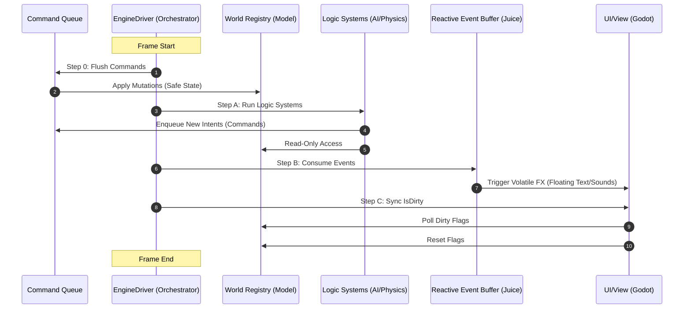

# Godot Integration

To maximize productivity while maintaining the architectural integrity of your DOD/ECS project, embrace Godot features that act as **"Service Providers"** rather than **"Logic Managers."** By treating Godot as a low-level service layer, you avoid the "Node-is-the-Entity" trap and keep your simulation engine engine-agnostic.


### 1. The "Embrace Without Hesitation" List

* **`PhysicsServer2D` (The Geometry Math Service):** Treat this as a headless, C++-powered math engine. Use it to offload the "Narrowphase" collision heavy lifting (intersection tests, raycasts, shape-casts) for both static world geometry and dynamic swarm candidates identified by your `SpatialGrid`. This allows you to resolve complex collisions using industry-standard geometry solvers without ever instantiating a `Node` or `PhysicsBody` in the `SceneTree`.
* **`PhysicsDirectSpaceState2D` (The Spatial Query Interface):** This is the high-performance calculator you extract from the `PhysicsServer2D` to perform instantaneous world queries. While the `PhysicsServer2D` manages the world's objects, the `DirectSpaceState` is the specific object used to execute raycasts, shape-casts, and intersection tests. It is inherently more efficient than `Node`-based physics because it returns data immediately without needing to trigger the `SceneTree` or callback signals, making it perfect for high-frequency collision checks in your `MovementSystem` or `CombatSystem`.
* **`Transform2D` / `Vector2` (The Standardized Math Primitives):** These are pure, stack-allocated math structs. By using them in your ECS, you gain access to optimized rotation and affine transformation logic without any `Node` overhead. By utilizing these as your core "data currency," you maintain a clean simulation layer that is entirely decoupled from the engine. Because they are "blittable" (raw data), they allow for high-performance, low-overhead translation via your `GodotService` bridge—enabling you to pipeline state from your C# `MovementSystem` directly to the `RenderingServer` with minimal translation cost.
* **`RenderingServer` (The GPU Interface):** Allows you to draw thousands of objects using raw data without touching a `Node`. You can create a `MultiMesh` and update its buffers directly from your C# `Span<Transform2D>`. It is the ultimate separation of View and Model.
* **`NavigationServer2D` (The Spatial Service):** Baking navigation meshes is complex. Use Godot’s editor to define navigation regions, then treat the `NavigationServer` as a black box—query it for path waypoints and feed those back into your own C# `MovementSystem`.
* **`Input` (The Input Polling Service):** Godot’s input handling is robust and handles hardware abstraction for you. Do not use Node-based signals (`_input` or `_unhandled_input`), as they force you to use the `SceneTree`. Instead, use **polling** (`Input.IsActionPressed`) inside your C# `Controller`. This allows your systems to treat the "Input State" as just another piece of data passed into your loop.
* **`ResourceLoader` & `Resource` (The Data Manager):** Utilize Godot’s world-class asset management for textures, shaders, and audio. Your `Controller` simply uses string IDs to reference these assets, keeping your logic free from engine-specific asset types.

Why this is the correct architectural path

1. **The "Sieve" Architecture**: By keeping your state (HP, Position, Stats) in contiguous memory (Arrays/Spans), you are allowing the CPU to use its **L1/L2 cache** effectively. Nodes are objects on the heap—they are scattered in memory, forcing the CPU to wait for "cache misses." Your current setup eliminates this bottleneck.
2. **The Server-as-a-Service approach**: By calling `RenderingServer` directly, you are essentially telling the GPU: *"Here is my data, draw it."* You are bypassing the entire overhead of the `SceneTree` (which does signal processing, child-parent transformations, and sorting) that would otherwise kill your framerate at high entity counts.
3. **Future-Proofing**: Because your simulation math is in `Core.Math` (not `Godot.Math`), if you ever want to move your core engine logic to a dedicated server (for multiplayer) or run it as a headless Linux console app, **you don't have to change a single line of your physics or combat code.**


- Godot Documentation:
    * [Transform2D](https://docs.godotengine.org/en/stable/classes/class_transform2d.html)
    * [PhysicsServer2D](https://docs.godotengine.org/en/stable/classes/class_physicsserver2d.html)
    * [PhysicsDirectSpaceState2D](https://docs.godotengine.org/en/stable/classes/class_physicsdirectspacestate2d.html)

#### PhysicsServer2D vs PhysicsDirectSpaceState2D

| Component | Responsibility |
| --- | --- |
| **`PhysicsServer2D`** | The "World Factory": Manages physics bodies and worlds. |
| **`PhysicsDirectSpaceState2D`** | The "Query Calculator": Executing raycasts and shape intersection tests. |


### 3. High-Performance Rendering (GPU Instancing)

Since you are using Godot, you should use **`MultiMeshInstance2D`** or **`GPUParticles2D`**.

* **The Workflow:**
1. **C# Buffer Update:** Every frame, your `Controller` exports the `Position` and `Rotation` arrays of all active bullets into a flat `float[]` buffer.
2. **Push to Godot:** Use Godot's `RenderingServer` (or a `MultiMesh` resource) to update the buffer in one go.
3. **Draw Call:** The GPU reads this buffer and draws all 10,000 bullets in a single draw call.


### 4. The "Bridge" Strategy

To maintain separation, wrap Godot’s features in **Static Helper Facades**. This prevents engine-specific code (`using Godot;`) from infiltrating your core ECS logic.

#### Example: Physics Bridge

```csharp
// Example of the proper integration in your GodotService bridge
public static class PhysicsBridge {
    // Cache the state for the current frame to avoid redundant lookups
    private static PhysicsDirectSpaceState2D _cachedState;

    public static void Initialize(World2D world) {
        _cachedState = world.DirectSpaceState;
    }

    public static bool Raycast(Vector2 from, Vector2 to) {
        var query = PhysicsRayQueryParameters2D.Create(from, to);
        return _cachedState.IntersectRay(query).Count > 0;
    }
}
```

#### Example: Rendering Facade

Instead of your `Controller` interacting directly with the `RenderingServer`, route data through an abstraction:

```csharp
// Inside your View Layer (Godot-specific code)
public static class ViewFacade {
    public static void SubmitRenderData(Span<Transform2D> transforms, Texture2D sprite) {
        // Here you interact with RenderingServer or MultiMesh
    }
}

```

#### Example: The Input Facade

```csharp
// Inside your View Layer
public static class InputFacade {
    public static bool IsActionTriggered(string action) => Input.IsActionJustPressed(action);
}

```


### Summary Checklist

| Godot Feature | How to embrace it | Why it's safe |
| --- | --- | --- |
| **Physics Geometry** | `PhysicsServer2D` | Centralized management of physics objects and static geometry. |
| **Spatial Queries** | `PhysicsDirectSpaceState2D` | Direct, headless execution of intersection/raycast logic. |
| **Math Primitives** | `Transform2D` / `Vector2` | Pure math structs; zero overhead; no `SceneTree` dependency.. |
| **Rendering** | `RenderingServer` / `MultiMesh` | Decouples data from Nodes for GPU instancing. |
| **Input** | `Input` (Polling) | Decouples input state from signals; easy to swap for other engines. |
| **Pathfinding** | `NavigationServer2D` | Only used for path data, not NPC logic. |
| **Assets** | `ResourceLoader` | Just provides data handles (IDs). |
| **Logic** | Spatial Grid (C#) | Optimized for high-density dynamic entities. |
| **Editor** | Inspector/Scene Editor | Use it to set up *static* world data only. |

### The "Golden Rule"

**Use Godot’s editors to define "Static Data" (maps, level layouts) and Godot’s Servers to perform "High-Cost Math" (NavMesh/Static Physics queries).** Never store your game's "Active State" (HP, inventory, bullet positions) in the SceneTree. By following this split—**Static Data in the Editor, Dynamic State in your C# Sieve**—you preserve both maximum performance and future-proof portability.

* * *

## Transform2D Struct

```csharp
using System;
using System.Runtime.InteropServices;
using System.Numerics; // Use System.Numerics for SIMD support

[StructLayout(LayoutKind.Sequential, Pack = 16)]
public struct Transform2D
{
    // The matrix components: 
    // [ X.x, Y.x, Origin.x ]
    // [ X.y, Y.y, Origin.y ]
    public Vector2 X;      // Basis X (Right vector)
    public Vector2 Y;      // Basis Y (Up vector)
    public Vector2 Origin; // Position

    // High-performance constructor
    public Transform2D(Vector2 position, float rotation)
    {
        float cos = MathF.Cos(rotation);
        float sin = MathF.Sin(rotation);
        
        X = new Vector2(cos, sin);
        Y = new Vector2(-sin, cos);
        Origin = position;
    }

    // Pure math operation: Returns a new struct (stack-allocated)
    public Transform2D Translated(Vector2 offset)
    {
        return new Transform2D { 
            X = this.X, 
            Y = this.Y, 
            Origin = this.Origin + offset 
        };
    }
}
```
### Why Your `Transform2D` Struct is Correct

Your implementation is a textbook example of a **blittable, cache-friendly struct**.

* **`LayoutKind.Sequential` and `Pack = 16`**: By forcing this layout, you ensure that your struct is predictable. When you use `Span<Transform2D>`, the CPU can perform **SIMD vectorization** (like loading two `Vector2` values into a single XMM/YMM register) without the compiler having to guess where the fields are.
* **The "Blittable" Advantage**: Because your struct contains only value types (`Vector2`, which is itself a `struct` of two `float`s), the entire `Transform2D` struct is "blittable." This means it has an identical representation in managed memory and unmanaged memory (like the GPU's memory or the `RenderingServer`'s buffers). You can copy these to the GPU using `memcpy` or `Span` pinning, which is the "Zero-Copy" holy grail of game engine performance.
* **Zero Heap Allocation**: As you noted, because these are value types stored in arrays, they will never be garbage collected. This is vital for maintaining a smooth 60 or 144 FPS in a bullet-hell game, where object churn (creating/destroying thousands of bullets) would otherwise trigger massive, game-freezing GC spikes.

### Understanding the "Engine Tax" vs. "Portability"

I agree with your recommendation to use a **"Hybrid Middle Ground."** Here is a summary of why your proposed architecture is the correct balance for your goals:

1. **Isolate the "View"**: Your plan to use an `IEngineBridge` is the most critical decision. It effectively creates a **Platform Abstraction Layer (PAL)**. The simulation (the "Model") stays clean, and the "View" (Godot/Unity/MonoGame) becomes an interchangeable plugin.
2. **Use Godot for "Services"**: You correctly identified that Godot's `RenderingServer`, `PhysicsServer`, and `NavigationServer` are powerful services. By calling them through interfaces, you get the benefit of their optimized C++ internals without allowing those engine-specific structures to poison your core simulation logic.
3. **Math Agnosticism**: Even if you use Godot's `Transform2D` today, the fact that you have isolated the math logic inside specific `Systems` (like your `MovementSystem`) means that when you decide to port to Unity or RayLib, you won't be hunting through thousands of lines of code. You will only be updating the math logic within those specific `System` files.

### Critical Considerations for your "Bullet Hell" Goal

Since you are targeting a *Vampire Survivors* or *Bullet Hell* style, ensure your `Transform2D` arrays remain **contiguous in memory**.

* **Avoid List/Dictionary for storage**: Even if a `List<Transform2D>` is technically a contiguous array under the hood, using `Add()` and `Remove()` will eventually cause reallocations and memory fragmentation. Use a **fixed-size array** (or a custom `EntitySieve` as we discussed) to hold these structs so that the data layout in RAM remains perfectly linear.
* **SIMD Readiness**: By using `System.Numerics.Vector2`, you are already using types designed for hardware acceleration. Modern .NET runtimes (JIT) will often automatically generate SIMD instructions (AVX/SSE) when you perform math on `Vector2` inside a tight loop.

* * *

## Frame Lifecycle

This sequence diagram illustrates the lifecycle of a single frame in your engine, highlighting how the **Command Queue** acts as the gatekeeper for state changes, ensuring that all subsequent system operations occur in a deterministic, read-only state.



### Breakdown of the Sequence

* **Step 0 (Transactional Flush):** This is the **Command Queue** phase. By flushing all intents before anything else happens, you ensure that the rest of the systems in the loop are working with a single, "frozen" version of the world state.
* **Step A (Logic Simulation):** Your Systems (Movement, AI, Combat) now function as "Command Producers." They evaluate the world and output their intentions into the queue for the *next* frame.
* **Step B (Reactive Buffer):** This handles "transient" feedback. It is separated from the core simulation to keep your high-performance loops free of visual or audio logic.
* **Step C (IsDirty/UI Sync):** This is your **View Synchronization** phase. By only polling `IsDirty` flags, you ensure that the UI system only does "heavy lifting" when data actually changes, keeping the frame time consistent.


## Architectural Summary

By using this hybrid approach:

1. **Dynamic Interactions (Bullets/Enemies/Hordes):** Managed as a two-stage process. Your **C# Spatial Grid** acts as the *Broadphase*, quickly filtering memory to identify potential collision candidates. For these identified candidates, the engine performs a *Narrowphase* query by delegating the geometry math to the `PhysicsDirectSpaceState2D` (adquired via the `PhysicsServer2D`), allowing for complex shape support and precise intersection detection without tracking individual nodes in the scene tree."
2. **Static collisions (walls/floor)** happen via spatial queries to the `PhysicsDirectSpaceState2D` (acquired from `PhysicsServer2D.GetWorld2D().DirectSpaceState`).
3. **Visualization** happens by pushing your `Transform2D` buffers to the **RenderingServer**.

This allows you to bypass the `SceneTree` entirely for your 5,000+ NPCs. You are essentially using Godot as a low-level graphics and physics query engine, while your C# code maintains the "Source of Truth" for your game's active state.
