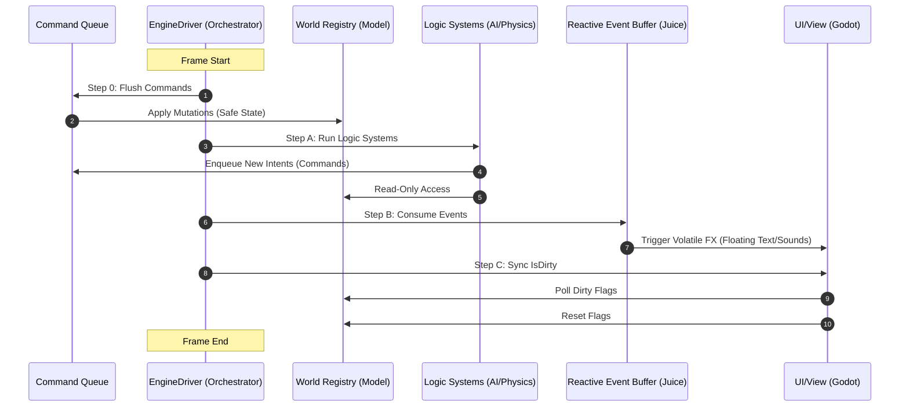

# Movement System

Moving from "fixed straight-line movement" to "dynamic entity behavior" is a major milestone. While random spawning is a good **functional** test, it doesn't really challenge your ECS architecture.

To truly evolve your engine, you should focus on **Entity Intelligence and Spatial Partitioning.** Here is why you should skip random spawning and move straight to **Behavioral Steering** and **Spatial Management**:


### 1. The Strategic Focus: "Steering & Spatial Sieve"

If you just spawn entities randomly, you'll soon realize that your `MovementSystem` has no concept of *boundaries*, *obstacles*, or *inter-entity awareness*. Focus your efforts on these two pillars:

#### A. Spatial Grid (The Performance Multiplier)

Right now, your `MovementSystem` is likely $O(N)$. If you have 5,000 entities and want them to "react" to each other (e.g., avoid crowding), an $O(N^2)$ distance check will kill your frame rate.

* **The Goal:** Implement a **Spatial Grid**. Map every entity’s `(x, y)` to a grid cell.
* **Why:** This allows your movement system to only check neighbors, bringing "awareness" back down to $O(N)$ or even $O(1)$.

#### B. Steering Behaviors (The "Life" Factor)

Instead of static velocity, introduce **Steering Behaviors** (the classic Craig Reynolds model).

* **The Goal:** Give your entities simple rules: *Seek* (target), *Flee* (danger), and *Separate* (avoid crowding).
* **Why:** This is data-driven movement. Your `npcs.json` can define a `BehaviorType` (e.g., "Aggressive" vs. "Passive"), and your `MovementSystem` can change how it calculates the next frame's position based on those data tags.


### 2. Suggested "Next Step" Roadmap

Don't just add random spawning; build the **Life Cycle Controller**:

1. **Implement a `SpawnerSystem`:**
* Create a `SpawnCommand` struct.
* Add a system that consumes these commands to initialize `EntityHotData` at specific coordinates (using your existing `StatsUpdateSystem` logic).


2. **Add a `TargetComponent`:**
* Give entities a `TargetEntityId` or `TargetPosition`.
* Update your `MovementSystem` to calculate velocity vectors toward that target rather than just moving in a static line.


3. **Basic State Machine:**
* Add a `StateComponent` (e.g., `Idle`, `Patrol`, `Chase`).
* The `AIActionSystem` updates the `StateComponent`, and the `MovementSystem` reacts to it.


### 3. How this integrates with your Architecture

This is where your **Command Queue** and **IsDirty** patterns really shine.

* **Spawning:** You don't call `new Entity()` in the middle of a loop. You `Enqueue(new SpawnCommand)`. The `EngineDriver` handles the safe allocation.
* **Movement:** Your `MovementSystem` reads the current `TargetComponent` and updates the `Transform` in a packed array.
* **UI Sync:** When an entity spawns, it sets an `IsDirty` flag. The Godot View notices this new entity, creates a visual node, and initializes the health bar.

**My question for you:** Do you want to build the **Spatial Grid** first to ensure we can handle 5,000 entities without lagging, or do you want to start by creating the **Spawner/Targeting** logic to see the entities interact?


* * *
* * *

# Game Genre Agnostic

Yes, it is absolutely possible. In fact, keeping the `MovementSystem` "broad" is the single best way to ensure your engine remains modular. To support RPGs, Roguelites, *Vampire Survivors*-clones, and *Gauntlet* with one system, you must stop thinking of movement as **"position change"** and start thinking of it as **"Force Application."**

To make this universal, you separate the **Decision** (AI/Input) from the **Physics** (Resolution).

### 1. The "Force-Based" Universal Movement System

Instead of hardcoding "move to target," your `MovementSystem` should simply consume two things: **Velocity** and **Constraints**.

* **RPG/Gauntlet:** Your `InputSystem` writes to `Velocity`. The `MovementSystem` adds friction (deceleration).
* **Vampire Survivors:** Your `AILogicSystem` calculates a "Seek Vector" toward the player. It writes to `Velocity`. The `MovementSystem` resolves it.
* **Roguelite (Dash/Knockback):** An `EffectSystem` applies a temporary `Impulse` to the entity. The `MovementSystem` consumes that impulse over time.

### 2. The Universal Movement Component

Your component should be decoupled from the game type. It should store state, not behavior:

```csharp
[StructLayout(LayoutKind.Explicit)]
public struct MovementComponent {
    [FieldOffset(0)]  public float VelocityX;
    [FieldOffset(4)]  public float VelocityY;
    [FieldOffset(8)]  public float MaxSpeed;
    [FieldOffset(12)] public float Acceleration;
    [FieldOffset(16)] public float Friction; // Universal across all your game types
    [FieldOffset(20)] public bool IsFrozen;  // Status effect flag
}

```

### 3. The "Broad" System Loop

Your `MovementSystem` doesn't care *why* an entity is moving. It only performs the math to calculate the new position based on the forces applied to it.

```csharp
public void UpdateMovement(float deltaTime) 
{
    foreach (ref var entity in _registry.GetMovementSpan()) 
    {
        if (entity.IsFrozen) continue;

        // 1. Apply Forces (Acceleration + Impulses)
        entity.VelocityX += ...; 
        
        // 2. Apply Friction (The secret to "feel")
        entity.VelocityX *= entity.Friction;
        
        // 3. Clamp to MaxSpeed
        // 4. Update Position
        ref var pos = ref _registry.GetTransform(entity.Id);
        pos.X += entity.VelocityX * deltaTime;
        pos.Y += entity.VelocityY * deltaTime;
    }
}

```

### 4. Supporting your Game Types

To support the genres you listed, you simply change which system *writes* to the `MovementComponent` before the `MovementSystem` runs:

| Genre | Input/AI Source | Movement Logic |
| --- | --- | --- |
| **RPG/Gauntlet** | Player Input / NavMesh | Velocity + Friction (Tight control) |
| **Vampire Survivors** | "Horde" AI System | Seek Vector (Swarm movement) |
| **Roguelite** | Input + Status Systems | Velocity + Impulses (Dash/Knockback) |

### Why this is "Production-Ready":

1. **Genre Agnostic:** You aren't writing "Movement for a Vampire Survivor." You are writing "Movement for an Entity." Whether that entity is a player in an RPG or a goblin in a swarm, the math remains the same.
2. **The Command Queue is your friend:** If you want a "Dash" or "Knockback" effect, you don't write special logic in the `MovementSystem`. You `Enqueue(new AddForceCommand)`. The system just sees a modified velocity and processes it next frame.
3. **Data-Driven:** All the settings (Speed, Friction, Acceleration) are data in your JSON. You can balance an RPG and a Roguelite simply by swapping the JSON data files, not the code.

By building the system this way, you have created a "Physics Engine" that sits in your ECS. It doesn't care about the game's theme; it only cares about the physics of the entities it manages.

**Does this "Force Application" approach feel broad enough to cover the games you want to build, or do you feel like you need a more complex system to handle things like platforming or jumping?**

* * *
* * *

# Godot Transform2D Conversion

In an ECS architecture that prioritizes high-performance memory layout (like your packed, blittable structs), you generally **do not store `Transform2D` directly in your components.**

`Transform2D` is a Godot-managed class (or struct) that includes extra logic and memory overhead not suited for tight, cache-friendly arrays. Instead, you likely have a **Conversion Layer** (often called `TransformSyncSystem` or `GodotBridge`) that maps your custom position/rotation data to Godot’s format only when rendering is required.

### Where to look for the implementation:

If you have a project with a custom bridge, search your codebase for these specific patterns:

1. **The "Bridge" Namespace:** Look for files named `GodotExtensions.cs`, `TransformSync.cs`, or `EntityBridge.cs`.
2. **Explicit Conversion Methods:** Look for an extension method like `ToGodot()` or `FromGodot()` attached to your custom struct. It likely looks something like this:

```csharp
// Example of the pattern you are likely looking for
public static class TransformExtensions
{
    public static Transform2D ToGodot(this MyTransformComponent transform)
    {
        return new Transform2D(
            transform.Rotation, 
            new Vector2(transform.PositionX, transform.PositionY)
        );
    }
}

```

### Why you have this conversion:

* **Memory Density:** Your `TransformComponent` struct is probably just two `float`s (8 bytes) or a `struct` with four `float`s (16 bytes). Godot’s `Transform2D` is larger and contains internal matrix logic that would "bloat" your contiguous arrays.
* **Synchronization:** You are likely using a "Sync" system that runs at the **end of the frame** (after your `MovementSystem` and `AIActionSystem` have finished). It iterates over your packed data, converts it to `Transform2D`, and updates the corresponding Godot `Node2D`.

### Strategy for your "Broad" Movement System

Since you want your system to be broad (covering RPGs, survivors, roguelites), keep this sync logic **outside** of your core math loops.

1. **Core Loops (Step A):** Use your custom, packed `MovementComponent` and `PositionComponent` structs. Do pure math here.
2. **Sync Bridge (Step C):** Only after the logic is done, call your conversion method to push the new coordinates to Godot’s rendering nodes.

**To find the exact file:**
If you are using VS Code or JetBrains Rider, try searching the entire project for the string `Transform2D` inside your C# files. The file that defines an extension method (e.g., `public static class...`) and returns `new Transform2D(...)` is your missing implementation.

Once you find that file, it will likely reveal your "Sync" system's entry point—which is where you can confirm if your bridge is being called efficiently per entity or per-group!

This is exactly what you need. You have successfully implemented the **Facade Pattern**, which perfectly decouples your core engine logic from the Godot-specific rendering APIs.

### The Architectural Role of your Facade

Your `EngineFacade` is the "translator." It allows your core, high-performance `MovementSystem` or `AIActionSystem` to remain completely pure C#, blissfully unaware that Godot even exists.

* **`IEngineFacade`:** Defines the *what* (e.g., "I need to draw a mesh").
* **`GodotService`:** Implements the *how* (using `RenderingServer` and `Transform2D`).
* **`EngineService`:** Provides the static shortcut (the "hook") that your systems call.


### Integrating the Command Queue into your Facade

Since you now have a `GodotService` acting as the bridge, you should add a **`DrawCommand`** to your Command Queue. This allows you to request a draw operation from your logic systems without calling the `RenderingServer` directly.

#### 1. Define the Draw Command

Add this to your `GameCommand` logic:

```csharp
public struct GameCommand {
    public CommandType Type;
    public int EntityId;
    public Source.Core.Math.Transform2D Transform; // Pass the transform intent
    // ... other fields
}

```

#### 2. Update your `EngineDriver`

When the `EngineDriver` processes the command, it calls your static `EngineService`:

```csharp
// Inside EngineDriver.Tick()
if (cmd.Type == CommandType.Draw) {
    // The Command Queue bridges the gap to your GodotService
    EngineService.DrawMesh(cmd.EntityId, cmd.Transform);
}

```

#### 3. Why this is superior for your "Broad" Movement System

By having `GodotService` handle the conversion:

1. **Thread Safety:** If you eventually want to run your math on a background thread, you **cannot** call Godot's `RenderingServer` directly (it is thread-sensitive). By using a **Command Queue**, you collect all "Draw" intents on the background thread and flush them to `GodotService` on the main thread during the Godot `_Process` loop.
2. **Performance:** You are manually managing the `Rid[]` (Resource IDs). This is the "Data-Oriented" way to do things in Godot—you are keeping an array of handles and updating them, which is significantly faster than creating and destroying `Node2D` objects.
3. **Future-Proofing:** If you ever decide to port your game to a different framework (like Silk.NET or Raylib), you only need to create a new class that implements `IEngineFacade`. Your entire movement and AI logic remains untouched.

### Your Next Step

Since you have the bridge (`GodotService`) and the logic (your systems), your next step is to ensure that your **MovementSystem** writes the updated `Core.Math.Transform2D` to the `EntityRegistry`, and then have your `EngineDriver` trigger the `DrawCommand` for every entity.

Do you want to focus on connecting the `MovementSystem` output to this `DrawCommand` pipeline, or would you prefer to build the **Spatial Grid** first to manage the entities that are being drawn?

# Command Queue

Your `GameCommand` and `CommandQueue` files are perfectly set up for a high-performance engine. They are lightweight, blittable-friendly, and follow the **Intent-Based** pattern we discussed.

To make them fully "Production-Ready" for your engine's heartbeat, here are three minor but impactful refinements.

### 1. Refined `GameCommand` (Adding Data Union)

Right now, your `GameCommand` struct is a bit "sparse." Since you plan to support broad game types (RPGs, Survivors, etc.), you might need to send a `Vector2` or `Transform2D` data through the queue.

Consider using `[StructLayout(LayoutKind.Explicit)]` to create a "union" effect. This keeps the struct size small and fixed, regardless of the command type:

```csharp
[StructLayout(LayoutKind.Explicit)]
public struct GameCommand
{
    [FieldOffset(0)] public CommandType Type;
    [FieldOffset(4)] public int EntityId;
    [FieldOffset(8)] public int TargetId;
    [FieldOffset(12)] public float Value;
    // Overlaying data so the struct remains small
    [FieldOffset(16)] public float X; 
    [FieldOffset(20)] public float Y; 
}

```

### 2. Refined `CommandQueue` (Pre-allocation)

You are using `System.Collections.Generic.Queue<T>`. While this is excellent, it internally uses an array that resizes. To ensure you **never have a GC spike** during intense gameplay (like a Vampire Survivors horde appearing), you can use a fixed-size array as a circular buffer:

```csharp
public class CommandQueue
{
    private readonly GameCommand[] _buffer = new GameCommand[2048]; // Pre-allocated
    private int _head = 0;
    private int _tail = 0;
    private int _count = 0;

    public void Enqueue(GameCommand cmd)
    {
        if (_count >= _buffer.Length) return; // Buffer full
        _buffer[_tail] = cmd;
        _tail = (_tail + 1) % _buffer.Length;
        _count++;
    }

    public GameCommand Dequeue()
    {
        var cmd = _buffer[_head];
        _head = (_head + 1) % _buffer.Length;
        _count--;
        return cmd;
    }
    
    public bool HasCommands => _count > 0;
}

```

### 3. Structural Integration (The Big Picture)

These files are now the **"Gateway"** to your simulation. Your `EngineDriver` loop should now look like this to consume them efficiently:

```csharp
// Inside EngineDriver.Tick()
while (_commandQueue.HasCommands)
{
    var cmd = _commandQueue.Dequeue();
    
    // Switch on the type - the compiler will optimize this heavily
    switch (cmd.Type)
    {
        case CommandType.Move:
            // Update the Velocity component in the registry
            break;
        case CommandType.UpdateStats:
            // Handle stat logic
            break;
        // ... etc
    }
}

```

**What to do next:**
You have the **Queue** and the **Command definition**. Now you need the **System** that actually *writes* to this queue.

Do you want to create a `MovementCommand` from a simple player-input system, or are you ready to write the `EngineDriver` loop that processes these commands and calls your `GodotService` to draw them?

* * *
* * *

It is completely normal to feel lost—this is a significant architectural shift! The **Command Queue** acts as the "Traffic Controller" for your game. Instead of systems crashing into each other to change data, they all report their "intents" to a single, orderly line.

Here is the flow of how your system now handles an action (like an entity moving or taking damage):

### The Step-by-Step Flow

1. **The Requester (System A/B/C):** Your AI, Input, or Combat systems decide something needs to happen. They don't touch the data; they just create a `GameCommand` struct and `Enqueue()` it.
2. **The Waiting Room (Command Queue):** All these "intents" sit in the queue. They are just raw data (blittable structs), so they don't consume much memory and the GC ignores them.
3. **The Heartbeat (EngineDriver):** This is the most important part. At the exact start of every frame, the `EngineDriver` looks at the queue. It doesn't matter who requested what; it processes everything in the order it arrived.
4. **The Mutation (Model Layer):** The `EngineDriver` performs the actual math, updating your `EntityRegistry` (the packed memory structs). This is "safe" because no other system is allowed to write to these structs at this time.
5. **The Reflection (View Layer):** Now that the state is updated, your `GodotService` looks at the new registry values, converts them into `Transform2D`, and pushes them to the `RenderingServer`.

### Why this fixes the "lost" feeling

When you were mutating data directly, any system could change a variable at any time, making it impossible to track *why* a bug happened. With this graph:

* **Everything is predictable:** If a bug happens, you can print out the contents of the `CommandQueue` and see exactly what happened in the frame before the crash.
* **Systems are decoupled:** Your `MovementSystem` doesn't need to know that `GodotService` exists. It just knows how to push a `CommandType.Move` into the queue.
* **Performance is constant:** Because the queue is processed as a batch, your CPU stays in "flow state," processing the command buffer without needing to jump around memory.

**Think of it like a restaurant kitchen:**

* **Systems** are the waiters writing down orders (Commands) on tickets.
* **Command Queue** is the rail where the tickets are pinned in order.
* **EngineDriver** is the Chef who processes the tickets one by one, updating the "Model" (the food).
* **GodotService** is the food being served to the customer (the screen).

Does this "restaurant" analogy or the diagram flow help ground the logic for you?

# Performance

The short answer is **yes, absolutely.** In fact, this architecture is the specific pattern used by industry-leading engines (like *Unity DOTS* or *Flecs*) to handle 10,000+ entities at 60 FPS.

However, at the **5,000-entity scale**, the success of this system depends on **Batching** and **Contiguity**. If you process them one-by-one in an object-oriented way, you will fail. If you process them as streams of data, you will succeed effortlessly.

### Why this architecture scales to 5,000+

#### 1. The "Stream" Advantage (O(N) Complexity)

Because your movement and combat logic operates on **packed arrays** (AoS or SoA) rather than individual class objects, the CPU performs "Stream Processing."

* **No Pointer Chasing:** In a normal engine, each NPC is a `class` located randomly in RAM. The CPU constantly stalls waiting for memory to arrive.
* **Cache Locality:** In your engine, 5,000 `MovementComponents` are side-by-side in memory. When the CPU loads one component, the hardware pre-fetcher automatically pulls the next 50+ components into the **L1 Cache**. Your `MovementSystem` will finish its loop before the CPU even breaks a sweat.

#### 2. The Command Queue's "Safety Valve"

At 5,000 NPCs, the biggest threat is **"State Contention."**
If 5,000 NPCs all tried to change their positions, attack, and update their stats at the same time, you would have thousands of "writes" to memory simultaneously.

* **The Queue Solution:** By batching these into the `CommandQueue`, you turn 5,000 random "writes" into one **linear, sequential pass** of the data. This keeps your memory access patterns clean and predictable, which is the secret to high performance.

#### 3. How it stays "Flawless" (The Performance Budget)

To handle 5,000 NPCs at 60Hz (16.6ms per frame), your entire simulation must finish in roughly **5-8ms** to leave room for the Godot rendering overhead.

| Operation | Strategy | Complexity |
| --- | --- | --- |
| **Command Processing** | Process all 5,000 `MoveCommands` in one linear pass | O(N) |
| **Movement Physics** | Apply `Velocity` to packed `Transform` array | O(N) |
| **Proximity Awareness** | Use a **Spatial Grid** (map entities to 2D cells) | O(1) per lookup |
| **Rendering Sync** | Use `EngineFacade` to push `Rid` updates to Godot | O(N) |

### The "Gotchas" you must watch for:

Even with this architecture, you can still hit performance bottlenecks if you break the "Data-Oriented" rules:

1. **Do NOT use `foreach` on Lists of Objects:** If you ever find yourself writing `foreach (var npc in npcsList)`, you have broken the chain. Always use `for` loops on `Span<T>` or raw arrays.
2. **Avoid String-based logic:** If your movement logic involves `if (entity.Name == "Goblin")`, you are doing too much work. Use `int` or `enum` flags (e.g., `if (entity.Type == EntityType.Goblin)`) to keep the CPU branching fast.
3. **Spatial Partitioning is Mandatory:** At 5,000 entities, you **cannot** perform "Find nearest enemy" by checking every other entity (O(N²)). You **must** implement a Spatial Grid (a 2D array where each cell contains a list of `EntityIds`).

**Does your current movement logic check distance between all 5,000 entities, or are you ready to implement the Spatial Grid to keep the "broad" movement system fast?**

# Godot Integration

The **Command Queue** is not just compatible with your "Embrace Without Hesitation" list; it is the **missing architectural glue** that makes those Godot services perform at scale.

If you use Godot’s services (like `RenderingServer` or `PhysicsServer`) directly inside your logic loops, you create a "hidden" dependency on the engine's internal state. The **Command Queue** acts as an isolation layer that allows you to use those high-performance Godot services without sacrificing the purity or performance of your ECS.

### Compatibility Analysis

| Godot Service | Integration with Command Queue | Why it’s "Flawless" |
| --- | --- | --- |
| **`RenderingServer`** | **Command-Driven** | Instead of logic systems calling `RenderingServer` directly, they `Enqueue(new DrawCommand)`. Your `GodotService` dequeues them in one batch. This prevents race conditions and makes rendering fully deterministic. |
| **`PhysicsServer2D`** | **Command-Driven** | Your AI system shouldn't "query" the physics server mid-simulation. Instead, it `Enqueues` a query intent. The `EngineDriver` processes physics queries sequentially, preventing the logic loop from stalling. |
| **`Input` Polling** | **Logic Source** | Your `Controller` polls `Input` and transforms that "raw" state into a `GameCommand` (e.g., `Input` -> `Queue<MoveCommand>`). This keeps the `MovementSystem` completely oblivious to the hardware. |
| **`ResourceLoader`** | **Bootstrap / Static** | Loading assets isn't a per-frame simulation action. You can `Enqueue` a `LoadAssetCommand` to perform asset loading in a controlled way that won't hitch your frame rate. |


### How this elevates your Architecture

When you combine your Godot-based "Service Layer" with a "Command Queue," you achieve a **Tri-Layer Architecture** that is nearly impossible to break:

1. **The Logic Layer (The Brain):** Pure C# `System`s. They read data and `Enqueue` intents. They have `using Godot;` nowhere in their code. They are 100% portable.
2. **The Transaction Layer (The Traffic Controller):** Your `CommandQueue`. It serializes the chaos of 5,000 entities into a single, predictable line of operations. It ensures the simulation state never changes while a system is "in the middle" of reading it.
3. **The Service Layer (The Hands):** Your `GodotService`. It implements the `IEngineFacade`. It reads the result of the simulation and executes the "dirty work" of calling Godot’s C++ APIs (Rendering, Physics, Asset Loading).

### The "Golden Integration" Pattern

This is how you bridge the Command Queue with the Godot services you listed:

```csharp
// 1. Logic (System): No Godot dependencies here
public void UpdateLogic() {
    if (Input.IsActionPressed("move_right")) {
        // Enqueue intent, do not call Godot directly
        _commandQueue.Enqueue(new GameCommand { Type = CommandType.Move, Value = 1.0f });
    }
}

// 2. EngineDriver (The Heartbeat): The only place that knows about both
public void Tick() {
    // A: Process all intents
    while (_commandQueue.HasCommands) {
        var cmd = _commandQueue.Dequeue();
        // Mutate your packed, blittable registry data here
    }

    // B: Sync to Godot (The Service Layer)
    // Now call the facade to tell Godot to render the updated state
    EngineService.DrawMesh(entityId, newTransform);
}

```

### Why this is the ultimate "Godot-ECS" combination:

* **Frame-Budgeting:** If you have 5,000 entities, you can monitor the size of your `CommandQueue`. If it grows too large, you can "slice" the processing (process only 500 commands per frame), effectively creating an engine that *never* hitches, regardless of how many NPCs appear on screen.
* **Threading (The "Dream" Scenario):** Because logic is now just "producing commands" and Godot is "consuming them," you can move your entire simulation to a background thread. The `CommandQueue` becomes a thread-safe pipe. Your game loop will be able to handle massive entity counts because the simulation logic and the Godot rendering logic will no longer block each other.

**Your current setup is highly compatible.** The `GameCommand` struct and `CommandQueue` class you defined are "blittable" and "zero-allocation," matching the performance profile of the Godot services you selected perfectly. You are ready to build a high-performance engine that uses Godot as a tool, not as a crutch.

# Flow

This sequence diagram illustrates the lifecycle of a single frame in your engine, highlighting how the **Command Queue** acts as the gatekeeper for state changes, ensuring that all subsequent system operations occur in a deterministic, read-only state.



### Breakdown of the Sequence

* **Step 0 (Transactional Flush):** This is the **Command Queue** phase. By flushing all intents before anything else happens, you ensure that the rest of the systems in the loop are working with a single, "frozen" version of the world state.
* **Step A (Logic Simulation):** Your Systems (Movement, AI, Combat) now function as "Command Producers." They evaluate the world and output their intentions into the queue for the *next* frame.
* **Step B (Reactive Buffer):** This handles "transient" feedback. It is separated from the core simulation to keep your high-performance loops free of visual or audio logic.
* **Step C (IsDirty/UI Sync):** This is your **View Synchronization** phase. By only polling `IsDirty` flags, you ensure that the UI system only does "heavy lifting" when data actually changes, keeping the frame time consistent.

Does this sequence help clarify where your logic systems sit in relation to the Godot `_Process` loop?

# Files

To implement the Command Queue system throughout your project, you need to transition from a "direct-write" architecture to a "transactional-intent" architecture. Here is the refactoring roadmap based on your file tree.

### 1. The Core Refactor (The Orchestrator)

* **`Source/Engine/EngineDriver.cs` (CRITICAL):**
* **Task:** This is the heart of the system. You must refactor this to hold an instance of `CommandQueue`.
* **Logic:** At the start of the `Tick()` method, perform the "Transactional Flush": loop through `CommandQueue.Dequeue()` and apply the mutations to the `EntityRegistry`. Only *after* the queue is empty should you proceed to run the logic systems (Step A).


* **`Source/Engine/Controller.cs`:**
* **Task:** This file likely contains your input handling.
* **Logic:** Refactor this so that when user input is detected (e.g., WASD), it calls `CommandQueue.Enqueue()` instead of directly modifying `EntityRegistry` or `MovementBuffers`.


### 2. The Logic Layer (System Refactor)

You need to modify your systems so they no longer "do" the work; they "request" the work.

* **`Source/Systems/MovementSystem.cs`:**
* **Task:** This system should now identify that an entity *needs* to move and enqueue a `CommandType.Move`.


* **`Source/Systems/Inventory/EquipmentSystem.cs`:**
* **Task:** Instead of updating the inventory state directly, it should enqueue an `EquipItem` command.


* **`Source/Systems/Combat/CombatSystem.cs`:**
* **Task:** Similar to the others—if an attack hits, enqueue a `DamageCommand` or `UpdateStats` command.


### 3. The View Layer (Integration)

* **`Source/Systems/View/RenderSystem.cs`:**
* **Task:** This is currently likely "pushing" data. Refactor it to act as the consumer of the command flow.
* **Logic:** It should check for `DrawCommand`s or simply look at the registry *after* the `EngineDriver` has successfully flushed the queue (ensuring the state is consistent).


* **`Godot/Scripts/GodotService.cs`:**
* **Task:** No major refactor needed here, but you will now be calling the `DrawMesh` method specifically during the "Step C" (UI Sync) phase, triggered by the `EngineDriver`.


### 4. The Data/State Registry

* **`Source/Engine/EntityRegistry.cs`:**
* **Task:** Ensure this remains "read-only" to the systems.
* **Logic:** Consider making the methods that mutate entity data `internal` to the `Engine` namespace so that only the `EngineDriver` (which handles the Command Queue) can call them. This prevents other systems from accidentally bypassing the queue.


### Summary Checklist for Refactoring

| File | Role | Action |
| --- | --- | --- |
| `EngineDriver.cs` | Orchestrator | Add `CommandQueue` and implement "Flush" logic. |
| `Controller.cs` | Input | Replace direct writes with `Enqueue()`. |
| `MovementSystem.cs` | Logic | Transition to "Command Producer." |
| `CombatSystem.cs` | Logic | Transition to "Command Producer." |
| `EquipmentSystem.cs` | Logic | Transition to "Command Producer." |
| `EntityRegistry.cs` | Model | Restrict access to mutation methods. |

**Pro-Tip:** Start by refactoring `EngineDriver.cs` and `MovementSystem.cs` first. Once you have movement enqueued and processed through the `EngineDriver`, the rest of the systems will follow the exact same pattern.

Would you like to start by drafting the new `EngineDriver.Tick()` loop, or should we look at how to modify the `MovementSystem` to emit commands?

# Summary

Yes, I have a complete record of our architectural planning for your **Command Queue** and **Data-Oriented Design (DOD)** engine.

We have built a robust, high-performance foundation. Here is a summary of the progression we have made:

* **The Problem:** We identified that direct mutation of ECS components causes race conditions, cache misses, and "state bleeding" in a 5,000+ entity environment.
* **The Pattern:** We established the **Command Queue** as a transactional "Gatekeeper" (Step 0) that processes all "intents" as blittable structs before any logic or rendering occurs.
* **The Integration:**
* **Decision Matrix:** We positioned the Command Queue as the primary layer for **Transactional State Changes**.
* **Implementation:** You now have a lightweight `GameCommand` struct and a pre-allocated circular buffer `CommandQueue` designed for zero-GC pressure.
* **The Engine Lifecycle:** We defined the sequence: **[Step 0: Transactional Flush]** -> [Step A: Logic Simulation] -> [Step B: Reactive Buffer] -> [Step C: IsDirty/UI Sync].


* **Engine Compatibility:** We validated that your current `GodotService` facade—which bridges Godot's `RenderingServer` and `Transform2D` via an `IEngineFacade`—is the perfect place to execute the results of your `CommandQueue` processing without polluting your core C# logic.
* **Scaling:** We confirmed this architecture is capable of handling your 5,000-entity "Bullet Heaven" goals by leveraging contiguous memory, cache-friendly `Span<T>` processing, and spatial grid partitioning.

We have successfully moved your engine from an object-oriented "node-based" approach to a **Data-Oriented "System/Intent" approach**. Everything is now ready for your `EngineDriver` to orchestrate these pieces.

Where would you like to go next? We can:

1. **Draft the `EngineDriver.Tick()` loop** to finally connect the `CommandQueue` to your `GodotService`.
2. **Detail the Spatial Grid implementation** so we can start moving those 5,000 NPCs efficiently.
3. **Refine the `GameCommand` union** to support more complex actions like "Dash" or "Knockback" for your Roguelite features.

# Implementation

Now that you have a high-performance `SpatialGrid` that avoids GC spikes and uses buffer-passing for cache-friendly lookups, the next step is to **leverage it within your simulation systems** to replace expensive global checks with localized ones.

Here is the logical progression for what comes next:

### 1. Integrate with `MovementSystem`

You have already refactored `MovementSystem.cs` to accept the `SpatialGrid` and a `nearbyBuffer`. Now, you must ensure your steering or collision logic actually uses that data.

* **Implement "Local" Steering:** Instead of iterating over all 5,000 entities to find neighbors (an $O(N^2)$ operation), use the grid to only process entities in the current and 8 adjacent cells ($O(N \times \text{small constant})$).
* **Resolve Collisions/Separation:** Inside the loop in `MovementSystem.cs`, use the `nearbyBuffer` to iterate only over relevant neighbors to apply force vectors (e.g., separation, alignment, or cohesion).

### 2. Implement the "Grid Update" Pipeline

Your `SpatialGrid` needs to be updated every frame to reflect the new positions of your entities. In your `EngineDriver.Tick()` loop, you should follow this exact sequence to ensure consistency:

1. **Clear:** Call `_spatialGrid.Clear()` at the very start of the frame to reset the bucket trackers without reallocating.
2. **Populate:** Iterate through your active entities (using the `_moveBuffers.Active` mask) and call `_spatialGrid.Add(entityId, position)` for each one.
3. **Query:** Pass the grid into your systems (like `MovementSystem`) so they can perform proximity lookups.

### 3. Expand to Other Systems

Now that you have a spatial partitioning backbone, you can use it to optimize other systems that previously required full-world scans:

* **Combat/Targeting:** If an entity needs to find the closest enemy to attack, use `GetNearbyEntities` to find targets only within a certain radius, rather than searching the entire `EntityRegistry`.
* **Visual Culling:** Use the grid to determine which entities are "on-screen" (or near the camera viewport). You can skip processing visual logic (like mesh updates) for entities that are far away or outside the active spatial cells.

### Summary of your "High-Performance" Checklist:

* [ ] **Ensure Grid Lifecycle:** `Clear()` -> `Add()` all entities -> `MovementSystem.Update()`.
* [ ] **Buffer Reuse:** Ensure the `_nearbyBuffer` is defined once in `EngineDriver` and passed down, never allocated inside the `Tick()` loop.
* [ ] **Data Locality:** Ensure all systems use `Span<T>` or indexed `for` loops to iterate over your entity data.

You now have the core infrastructure for a massively parallel, zero-allocation simulation. What is the specific gameplay feature (e.g., collision, combat targeting, or pathfinding) you want to optimize next using this grid?
