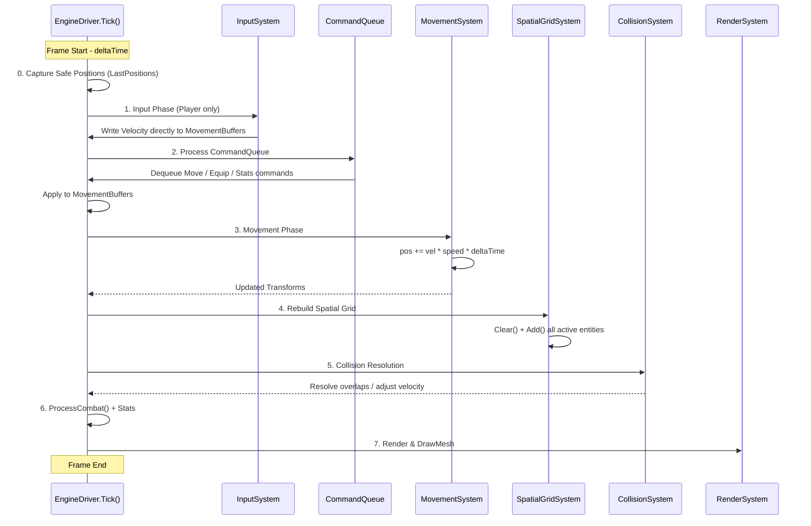

# Movement System

## 1. Architectural Overview: Intent vs. Execution

The Movement System embodies a core philosophy of **"Intent vs. Execution"**:

- **Intent Layer**: Player input (`InputSystem`) and external systems (`GameCommand` queue) express *what* should happen.
- **Execution Layer**: `EngineDriver.Tick()` + `MovementSystem.Update()` deterministically resolves movement, followed by spatial/collision systems.

This separation keeps the simulation **deterministic**, **platform-agnostic**, and scalable. The engine uses a **hybrid approach**:
- **Player**: Immediate direct writes for snappy responsiveness.
- **NPCs/Systems**: Transactional `CommandQueue` for safety and batch processing.

**Current Implementation** (from source):
- Basic Euler integration in `MovementSystem`.
- SoA buffers for cache efficiency.
- Post-movement spatial grid rebuild + collision validation.


## 2. Sequence Diagram (Mermaid)



**Key Flow**: Player input is immediate. All other intents go through the queue. Movement always precedes spatial + collision.


## 3. Core Components

### Data Layout – MovementBuffers (SoA)

```csharp
public class MovementBuffers
{
    public Transform2D[] Transforms = new Transform2D[EngineConfig.MaxEntities];
    public Vector2[] Velocities = new Vector2[EngineConfig.MaxEntities];
    public Vector2[] LastPositions = new Vector2[EngineConfig.MaxEntities];
    public float[] Speeds = new float[EngineConfig.MaxEntities];
    public bool[] Active = new bool[EngineConfig.MaxEntities];
    public bool[] HasLastPosition = new bool[EngineConfig.MaxEntities];
}
```

**Why SoA?** Excellent cache locality for 1024+ entities. All hot data is contiguous in memory.

### Core Movement Logic (`MovementSystem.cs`)

```csharp
public static void Update(
    Span<Transform2D> transforms,
    Span<Vector2> velocities,
    Span<float> speeds,
    ReadOnlySpan<bool> activeMask,
    float deltaTime)
{
    for (int i = 0; i < transforms.Length; i++)
    {
        if (!activeMask[i]) continue;
        transforms[i].Origin += velocities[i] * speeds[i] * deltaTime;
    }
}
```

Simple, predictable Euler integration. No acceleration/friction yet — intentionally minimal for broad applicability.

### Transform2D (`Transform2D.cs`)

```csharp
[StructLayout(LayoutKind.Sequential, Pack = 16)]
public struct Transform2D
{
    public Vector2 X, Y;   // Basis vectors (future rotation)
    public Vector2 Origin; // Position
    ...
}
```

Godot conversion happens only in the Render phase via `IEngineFacade` / `RenderSystem`.


## 4. Player vs NPC Movement Paths

| Path              | Latency     | Target          | Implementation                          | Use Case |
|-------------------|-------------|-----------------|-----------------------------------------|----------|
| **Immediate**     | Ultra-low   | Player          | `InputSystem` → direct buffer write     | Responsive controls |
| **Transactional** | 1-frame     | NPCs / AI       | `GameCommand.Move` → CommandQueue       | Scalable hordes |

This dual-path design is explicitly supported in `EngineDriver.Tick()`.


## 5. Spatial Grid Integration

The **SpatialGrid** is the performance backbone:

- **Grid Specs**: 64px cells, ~30×17 grid for 1920×1080.
- **Lifecycle** (every frame):
  1. `Clear()`
  2. `Add()` all active entities using new positions
  3. `GetNearbyEntities()` (3x3 neighborhood) for collision/steering/combat

This replaces O(N²) checks with near O(1) local queries.


## 6. Genre-Agnostic Design & Future Evolution

The current system is a solid **foundation** for multiple genres (RPG, Vampire Survivors-style, Roguelites, Gauntlet).

**Recommended Evolution**: Transition toward a **Force-Based** model.

**Proposed Universal MovementComponent** (future):

```csharp
[StructLayout(LayoutKind.Explicit)]
public struct MovementComponent
{
    [FieldOffset(0)]  public float VelocityX;
    [FieldOffset(4)]  public float VelocityY;
    [FieldOffset(8)]  public float MaxSpeed;
    [FieldOffset(12)] public float Acceleration;
    [FieldOffset(16)] public float Friction;
    [FieldOffset(20)] public bool IsFrozen;
}
```

**Broad System Loop** (target):

- AI/Input writes forces/vectors.
- MovementSystem applies acceleration → friction → clamping → position.

**Genre Mapping**:

| Genre                | Input Source               | Movement Style                  |
|----------------------|----------------------------|---------------------------------|
| RPG / Gauntlet       | Player Input               | Tight velocity + friction       |
| Vampire Survivors    | AI Seek System             | Swarm seek vectors              |
| Roguelite            | Input + Effects            | Impulses (dash/knockback)       |

All settings remain **data-driven** via JSON (races/classes/items).


## 7. Godot Integration & Transform Conversion

Movement logic stays pure C# (no Godot dependencies). 

- `RenderSystem` + `IEngineFacade` handles conversion from custom `Transform2D` to Godot’s `Transform2D`.
- Use `CommandQueue` for draw intents where possible for thread-safety and determinism.
- Sync happens at frame end after all simulation steps.


## 8. Command Queue Role in Movement

The `CommandQueue` acts as the **Traffic Controller**:

- Systems enqueue `CommandType.Move` instead of direct mutation.
- `EngineDriver` flushes queue before `MovementSystem`.
- Enables safe batching and future background threading.


## 9. Performance Characteristics & Optimization Checklist

**Strengths**:
- SoA + Span<T> → excellent cache behavior
- Zero allocations in hot path
- Spatial grid prevents brute-force checks
- Bounded by `EngineConfig.MaxEntities` (1024)

**Optimization Checklist**:
- Always use `Span<T>` / index loops (no `foreach` on Lists)
- Reuse temporary buffers (`ArrayPool<T>`)
- Keep `Tick()` free of allocations
- Full grid rebuild is acceptable now — optimize later with dirty moves if needed

**Target Scale**: Comfortably handles 5,000+ entities with proper batching and spatial queries.

**Current Limitations**:
- Basic Euler (tunneling risk at high speeds)
- No continuous collision detection
- No built-in acceleration/friction


## 10. Implementation Roadmap

**Short-term**:
- Add friction/acceleration to `MovementSystem`
- Ensure all non-player systems use `CommandQueue`

**Medium-term**:
- Introduce `MovementComponent`
- Add steering behaviors (Seek, Separate) using spatial grid

**Long-term**:
- AI State Machine → writes to movement intents
- Full force/impulse system
- Threaded simulation via command queue
