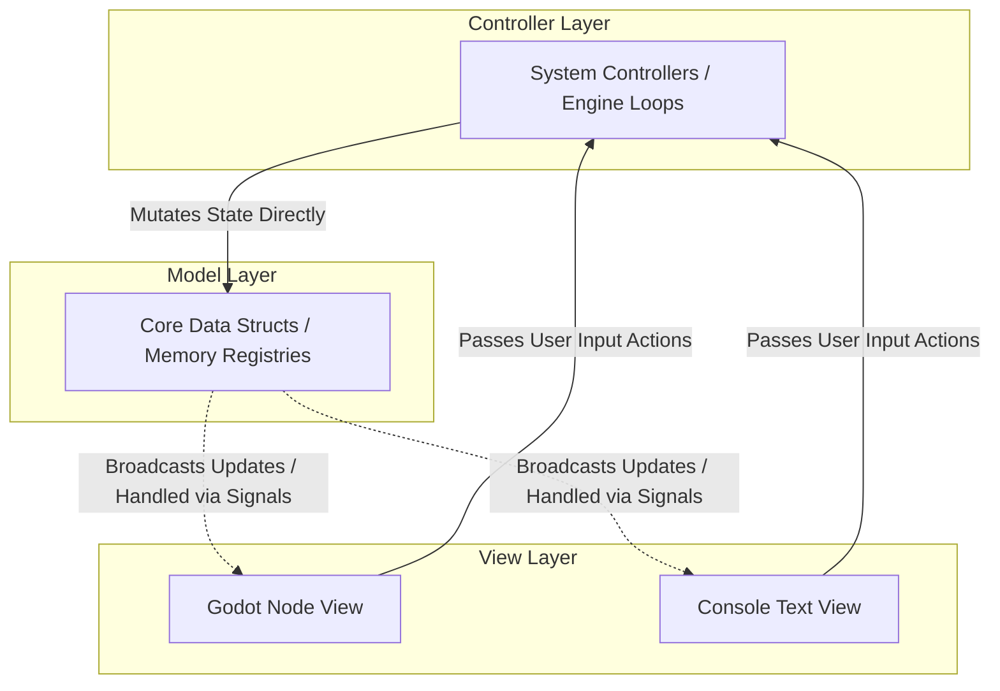

# Model-View-Controller (MVC) Architectural Pattern

The Model-View-Controller (MVC) pattern divides a software application into three interconnected components. This separation of concerns is particularly crucial in game development, where it allows you to decouple your core simulation, calculations, and mechanics from platform-dependent visual engines (such as Godot, Unity, or raw text consoles).

---

## The Core Triad of MVC



### 1. The Model (Data)

The Model represents the pure data matrix and state of the application. In a high-performance or data-driven context, it should consist solely of variables, primitive fields, structures, and arrays. It has **zero knowledge** of how it is displayed and contains no input-handling or rendering instructions.

### 2. The View (Presentation)

The View reads values directly from the Model to render them visually onto the screen. It translates internal structural variables into visual nodes, UI text boxes, sprites, or sound cues. The View is strictly **read-only** regarding the Model; it is forbidden from directly mutating model variables.

### 3. The Controller (Logic & Execution)

The Controller contains the execution rules, state machines, simulation algorithms, and timelines. It intercepts inputs from the View or tracks elapsed time frames, processes the mathematical logic, and mutates data directly within the Model layer.

---

# Best Design Patterns to Implement MVC

To implement a clean, production-ready MVC architecture without letting the layers bleed into each other, you need gatekeeper design patterns. Below are the four most effective patterns to implement MVC safely.

## 1. Abstract Factory Pattern

* **Best For:** Decoupling the **Model Initialization** from the Controller, preventing hardcoded engine or class dependencies during world generation.
* **How It Works:** When the Controller reads a configuration file (like a JSON blueprint) to build the game world, it must not instantiate concrete objects using the `new` keyword. Instead, the Controller relies on an abstract factory interface. This allows you to swap out factories to change the underlying initialization logic entirely without touching your core simulation scripts.

```csharp
// Abstract interface used strictly by the Controller
public interface IEntityFactory
{
    void CreatePlayerEntity(int id, float x, float y);
}

// Concrete implementation used when running the game inside Godot
public class GodotEntityFactory : IEntityFactory
{
    public void CreatePlayerEntity(int id, float x, float y)
    {
        // Spawns a physical visual scene graph node into the Godot Engine
        var playerNode = Godot.ResourceLoader.Load<Godot.PackedScene>("res://Player.tscn").Instantiate();
        // Sets up data registration concurrently
    }
}

```

## 2. Command Pattern

* **Best For:** Decoupling **Model Mutation** from the Controller and View, preventing hardcoded function calls and state manipulation logic.
* **How It Works:** Instead of the View or a sub-system modifying Model data directly, every action, player input, or environment transaction is encapsulated into a standalone, executable data capsule. The Controller manages an isolated command queue, executing these transactions sequentially.

```csharp
// The uniform behavioral contract
public interface ICommand
{
    void Execute(ref WorldData world);
}

// A concrete command encapsulating a change to a player's health data struct
public struct DamagePlayerCommand : ICommand
{
    private readonly int _targetEntityId;
    private readonly int _damageAmount;

    public DamagePlayerCommand(int entityId, int damage)
    {
        _targetEntityId = entityId;
        _damageAmount = damage;
    }

    public void Execute(ref WorldData world)
    {
        // Mutates the pure value struct safely inside the contiguous model array
        world.HealthComponents[_targetEntityId].CurrentHP -= _damageAmount;
    }
}

```

## 3. Observer Pattern (Reactive Streams / Signals)

* **Best For:** Alerting the **View** of changes inside the **Model** without the Model ever needing to hold references to graphic components or engine nodes.
* **How It Works:** In classic OOP, the Model exposes events that the View subscribes to. In a performance-oriented or ECS composition framework, traditional events can cause memory fragmentation. Instead, you can use specialized reactive bitwise flags ("dirty bits") or atomic transaction queues. The View reads these indices at the end of a execution loop frame and updates matching screen visuals accordingly.

```csharp
// A lightweight pure value layout residing inside the Model
public struct HealthComponent
{
    public int CurrentHP;
    public bool IsDirty; // High-performance flag monitored by observer views
}

// The View system updates engine representations based on tracking changes
public class ViewHealthBarObserver
{
    public void SyncVisuals(ReadOnlySpan<HealthComponent> healthData, GodotProgressBarNode[] bars)
    {
        for (int i = 0; i < healthData.Length; i++)
        {
            in var health = ref healthData[i];
            if (health.IsDirty)
            {
                // Visual presentation node adapts automatically to pure backend numbers
                bars[i].SetProgressValue(health.CurrentHP);
            }
        }
    }
}

```

## 4. Mediator Pattern

* **Best For:** Preventing **Sub-System Managers** inside the Controller layer from cross-referencing and tangling with each other as systems expand.
* **How It Works:** Rather than letting decoupled systems make explicit function calls across boundaries (e.g., a `CombatSystem` calling the `QuestSystem` or `SoundViewSystem` directly), systems broadcast abstract event structs into a central communications hub. The Mediator safely routes those data slices to any registered layers listening for them.

```csharp
public struct EntityDiedEvent
{
    public int DeadEntityId;
    public int KillerEntityId;
}

public class GameEventMediator
{
    private readonly List<Action<EntityDiedEvent>> _listeners = new();

    public void Subscribe(Action<EntityDiedEvent> listener) => _listeners.Add(listener);
    
    public void Broadcast(in EntityDiedEvent evt)
    {
        foreach (var listener in _listeners)
        {
            listener(evt); // Transmits transaction details instantly to all sub-systems
        }
    }
}

```

---

# Implementation Strategy Summary

| Pattern | MVC Boundary Responsibility | Structural Benefit |
| --- | --- | --- |
| **Abstract Factory** | Controls how the **Controller initializes the Model** | Ensures structural logic loops can switch platforms (Console testing vs. Live Engine deployment) seamlessly. |
| **Command** | Controls how the **Controller mutates the Model** | Eliminates rigid code structures, creating a transactional pipeline useful for multiplayer sync, scheduling, and action replays. |
| **Observer** | Controls how the **View reads data from the Model** | Enables immediate visual representation syncs without leaking UI, framework, or rendering assets into core simulation files. |
| **Mediator** | Controls how **Internal Controller modules share information** | Stops complex multi-system logic chains from degenerating into unmaintainable, tightly coupled dependencies. |
