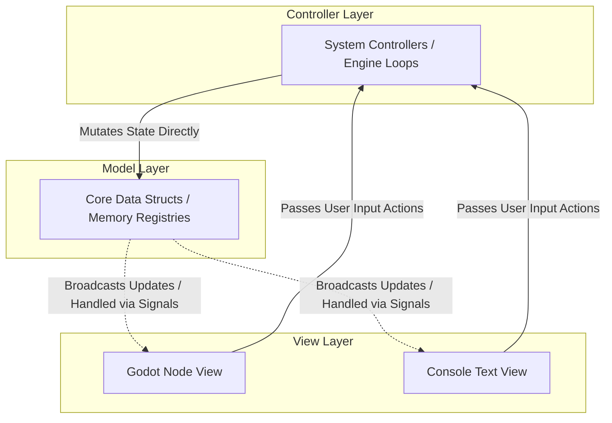
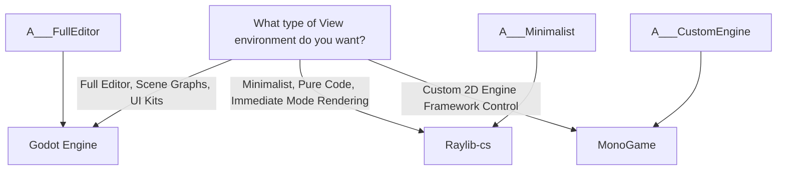
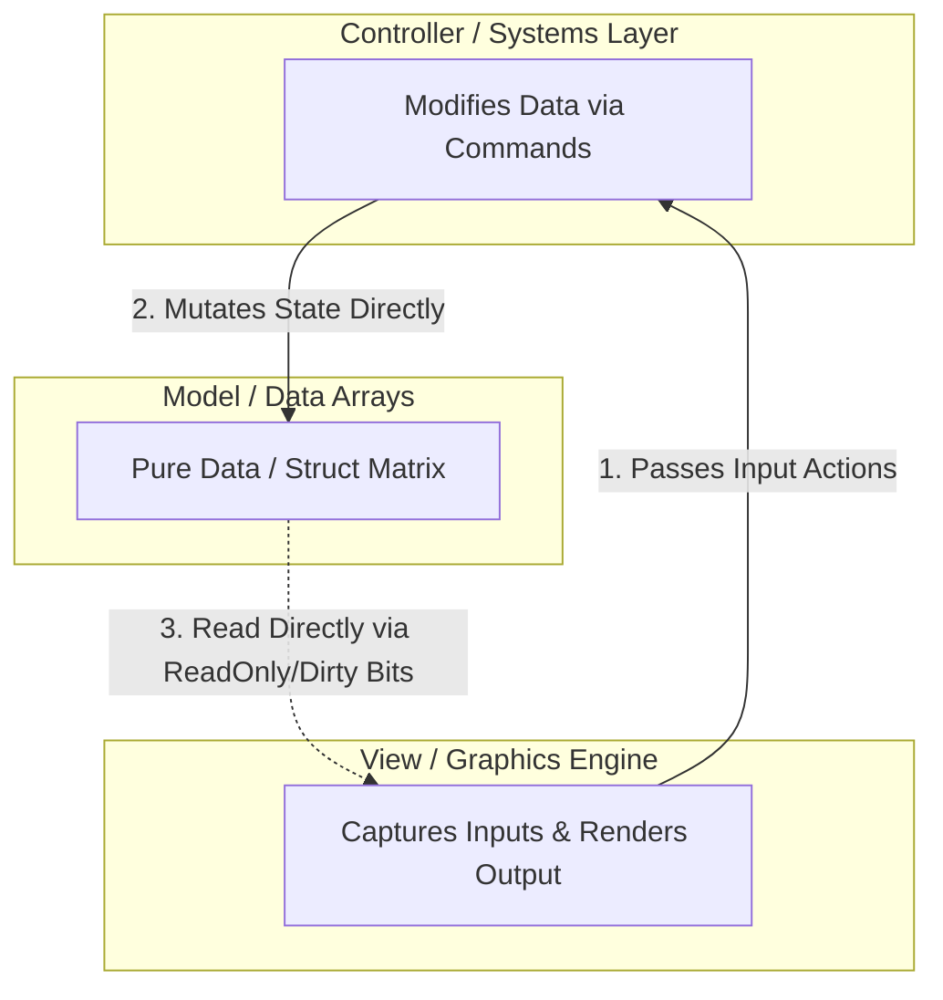
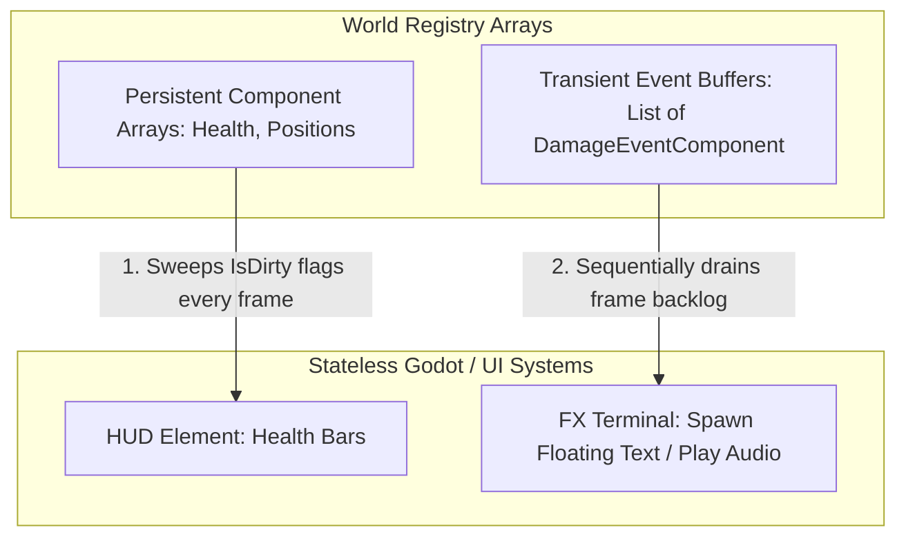

# Model-View-Controller (MVC) Architectural Pattern

The Model-View-Controller (MVC) pattern divides a software application into three interconnected components. This separation of concerns is particularly crucial in game development, where it allows you to decouple your core simulation, calculations, and mechanics from platform-dependent visual engines (such as Godot, Unity, or raw text consoles).

---

## The Core Triad of MVC



### 1. The Model (Data)

The Model represents the pure data matrix and state of the application. In a high-performance or data-driven context, it should consist solely of variables, primitive fields, structures, and arrays. It has **zero knowledge** of how it is displayed and contains no input-handling or rendering instructions.

### 2. The View (Presentation)

The View reads values directly from the Model to render them visually onto the screen. It translates internal structural variables into visual nodes, UI text boxes, sprites, or sound cues. The View is strictly **read-only** regarding the Model; it is forbidden from directly mutating model variables.

### 3. The Controller (Logic & Execution)

The Controller contains the execution rules, state machines, simulation algorithms, and timelines. It intercepts inputs from the View or tracks elapsed time frames, processes the mathematical logic, and mutates data directly within the Model layer.

---

# Best Design Patterns to Implement MVC

To implement a clean, production-ready MVC architecture without letting the layers bleed into each other, you need gatekeeper design patterns. Below are the four most effective patterns to implement MVC safely.

## 1. Abstract Factory Pattern

* **Best For:** Decoupling the **Model Initialization** from the Controller, preventing hardcoded engine or class dependencies during world generation.
* **How It Works:** When the Controller reads a configuration file (like a JSON blueprint) to build the game world, it must not instantiate concrete objects using the `new` keyword. Instead, the Controller relies on an abstract factory interface. This allows you to swap out factories to change the underlying initialization logic entirely without touching your core simulation scripts.

```csharp
// Abstract interface used strictly by the Controller
public interface IEntityFactory
{
    void CreatePlayerEntity(int id, float x, float y);
}

// Concrete implementation used when running the game inside Godot
public class GodotEntityFactory : IEntityFactory
{
    public void CreatePlayerEntity(int id, float x, float y)
    {
        // Spawns a physical visual scene graph node into the Godot Engine
        var playerNode = Godot.ResourceLoader.Load<Godot.PackedScene>("res://Player.tscn").Instantiate();
        // Sets up data registration concurrently
    }
}

```

## 2. Command Pattern

* **Best For:** Decoupling **Model Mutation** from the Controller and View, preventing hardcoded function calls and state manipulation logic.
* **How It Works:** Instead of the View or a sub-system modifying Model data directly, every action, player input, or environment transaction is encapsulated into a standalone, executable data capsule. The Controller manages an isolated command queue, executing these transactions sequentially.

```csharp
// The uniform behavioral contract
public interface ICommand
{
    void Execute(ref WorldData world);
}

// A concrete command encapsulating a change to a player's health data struct
public struct DamagePlayerCommand : ICommand
{
    private readonly int _targetEntityId;
    private readonly int _damageAmount;

    public DamagePlayerCommand(int entityId, int damage)
    {
        _targetEntityId = entityId;
        _damageAmount = damage;
    }

    public void Execute(ref WorldData world)
    {
        // Mutates the pure value struct safely inside the contiguous model array
        world.HealthComponents[_targetEntityId].CurrentHP -= _damageAmount;
    }
}

```

## 3. Observer Pattern (Reactive Streams / Signals)

* **Best For:** Alerting the **View** of changes inside the **Model** without the Model ever needing to hold references to graphic components or engine nodes.
* **How It Works:** In classic OOP, the Model exposes events that the View subscribes to. In a performance-oriented or ECS composition framework, traditional events can cause memory fragmentation. Instead, you can use specialized reactive bitwise flags ("dirty bits") or atomic transaction queues. The View reads these indices at the end of a execution loop frame and updates matching screen visuals accordingly.

```csharp
// A lightweight pure value layout residing inside the Model
public struct HealthComponent
{
    public int CurrentHP;
    public bool IsDirty; // High-performance flag monitored by observer views
}

// The View system updates engine representations based on tracking changes
public class ViewHealthBarObserver
{
    public void SyncVisuals(ReadOnlySpan<HealthComponent> healthData, GodotProgressBarNode[] bars)
    {
        for (int i = 0; i < healthData.Length; i++)
        {
            in var health = ref healthData[i];
            if (health.IsDirty)
            {
                // Visual presentation node adapts automatically to pure backend numbers
                bars[i].SetProgressValue(health.CurrentHP);
            }
        }
    }
}

```

## 4. Mediator Pattern

* **Best For:** Preventing **Sub-System Managers** inside the Controller layer from cross-referencing and tangling with each other as systems expand.
* **How It Works:** Rather than letting decoupled systems make explicit function calls across boundaries (e.g., a `CombatSystem` calling the `QuestSystem` or `SoundViewSystem` directly), systems broadcast abstract event structs into a central communications hub. The Mediator safely routes those data slices to any registered layers listening for them.

```csharp
public struct EntityDiedEvent
{
    public int DeadEntityId;
    public int KillerEntityId;
}

public class GameEventMediator
{
    private readonly List<Action<EntityDiedEvent>> _listeners = new();

    public void Subscribe(Action<EntityDiedEvent> listener) => _listeners.Add(listener);
    
    public void Broadcast(in EntityDiedEvent evt)
    {
        foreach (var listener in _listeners)
        {
            listener(evt); // Transmits transaction details instantly to all sub-systems
        }
    }
}

```

---

## Implementation Strategy Summary

| Pattern | MVC Boundary Responsibility | Structural Benefit |
| --- | --- | --- |
| **Abstract Factory** | Controls how the **Controller initializes the Model** | Ensures structural logic loops can switch platforms (Console testing vs. Live Engine deployment) seamlessly. |
| **Command** | Controls how the **Controller mutates the Model** | Eliminates rigid code structures, creating a transactional pipeline useful for multiplayer sync, scheduling, and action replays. |
| **Observer** | Controls how the **View reads data from the Model** | Enables immediate visual representation syncs without leaking UI, framework, or rendering assets into core simulation files. |
| **Mediator** | Controls how **Internal Controller modules share information** | Stops complex multi-system logic chains from degenerating into unmaintainable, tightly coupled dependencies. |

* * *

# The View

Since your primary architectural mandate is that **the C# Model layer must remain completely identical, platform-agnostic, and compiled independently** of the frontend, your choice of View framework depends entirely on **how** that framework allows its visual objects to map onto a pure, external data model.

In a strict MVC setup, the View is a stateless presentation layer. It queries data via fast read-only reference structures (`ReadOnlySpan<T>` and the `in` modifier) or bitwise dirty tracking flags. It should never "own" the entity data, nor should it force its own base classes (like Unity's `MonoBehaviour` or Godot's `Node`) into your core business model files.

Here is an evaluation of the best frameworks and libraries for your MVC View layer, categorized by how seamlessly they accommodate this strict separation.

### Tier 1: Exceptional Fit (Native C# Value Pipelines)

These frameworks operate beautifully under a "pure data model + stateless presenter view" workflow.

#### 1. Godot Engine (C# Core)

Godot is arguably the most streamlined mainstream engine for this specific architectural choice.

* **Why it fits MVC perfectly:** Godot splits objects into clean `Node` trees that can be instantiated dynamically from string resource paths (`res://Player.tscn`). An abstract factory inside your controller can read a data layout config file (like `definitions.json`), and hand commands or entity IDs to a custom Godot Presenter script.
* **The View Mapping:** The Godot View script completely ignores engine scene hierarchies during core calculations. Every frame or event tick, a Godot `_Process` function requests a data window from your `WorldRegistry`, checks the `IsDirty` tracking flags, and updates positions or visual progressive bars matching those pure data coordinates. Your model never knows Godot exists.

#### 2. Raylib (via Raylib-cs)

Raylib is a lightweight, low-level, immediate-mode rendering library. It is an extraordinary fit for a pure data core.

* **Why it fits MVC perfectly:** Immediate-mode rendering naturally demands an MVC structure. Raylib doesn't have an editor, scene graphs, or object definitions that dictate how you structure memory.
* **The View Mapping:** Your View system is literally a flat sequence of draw calls. You feed a `ReadOnlySpan<StatsComponent>` straight into your Raylib view system. It loops through the memory span sequentially, reading `PositionX` and `PositionY` properties, and invokes `Raylib.DrawTexture(...)`. Because there are no engine wrappers or managed heap node objects to maintain, this is the cleanest implementation of a stateless view.

### Tier 2: Good Fit (Requires Minor Adaptation Loops)

These frameworks work incredibly well but require you to write a clean boilerplate layer to stop engine conventions from bleeding into your Model.

#### 3. MonoGame / FNA

MonoGame gives you total control over the architecture, positioning itself halfway between Raylib and a full engine.

* **Why it fits MVC:** Like Raylib, MonoGame does not force an object component hierarchy on you. It gives you a blank canvas with a structured `Draw(GameTime)` loop.
* **The View Mapping:** The only minor complication is managing asset pipelines (XNB files) and textures. You will need your View layer to hold a dictionary mapping your abstract JSON data IDs (e.g., `WeaponDefinitionId: 10`) to real GPU texture instances. Once that translation layer is set up, MonoGame streams your contiguous data models with exceptional performance.

### Tier 3: Poor Fit (Resists MVC Abstraction)

While highly popular, this ecosystem presents constant friction if you try to decouple the Model completely.

#### 4. Unity (Standard MonoBehaviour Setup)

* **The Structural Friction:** Unity is traditionally built around an integrated OOP component model (`MonoBehaviour`). It fundamentally expects data, presentation, lifecycle events (`Start`, `Update`), and engine physics to be welded into a singular class instance.
* **Why it fights your architecture:** If you try to pass an external pure C# class or struct registry into Unity, you are actively fighting the editor's design. You cannot easily drag-and-drop or inspect decoupled data models in the inspector out of the box. To make true MVC work in Unity, you have to treat GameObjects as dumb, stateless visual wrappers that poll an external simulation registry via lookups, which wastes much of Unity's built-in workflow utility.
*(Note: Unity’s modern **DOTS/Entities** package is an ECS, but it enforces its own memory allocations and native tracking arrays, making it impossible to keep your model identical across other frameworks like Godot or a text console).*

## Summary Recommendation

To maintain a model that remains entirely unchanged regardless of the View, select your framework based on your layout requirements:



1. **Choose Godot** if you want a complete, professional graphics editor, animation timelines, and robust visual UI tools while keeping your C# Core completely uncoupled.
2. **Choose Raylib-cs** if you want the purest, fastest code-only implementation where the View layer is just an execution stream reading raw data blocks.

Both will allow your separate backend simulation engine to remain perfectly preserved, running exactly the same on a text-based console server as it does on a rich graphical interface.

# Model & Controller

### The Real Data Flow Sequence

1. **The View Captures Input:** The user presses a key or clicks a button on the UI screen. The View captures this interaction, packages it, and tells the **Controller** what action was requested (often via a *Command* object).
2. **The Controller Processes Logic:** The Controller intercepts this request, runs the simulation rules (like pathfinding, collision checks, or stat reductions), and **directly mutates the variables inside the Model.**
3. **The View Reads the Model:** Once the Model's data has changed, the **View reads the new numbers directly from the Model** to update what is rendered on screen.



### If the View reads the Model directly, how are they decoupled?

You might wonder: *If the View reads the Model directly, doesn't that break the separation of concerns?*

This is where the **Observer Pattern (or Dirty Flag system)** saves your architecture. The View reads the Model under two incredibly strict conditions:

1. **It is entirely Read-Only:** The View is legally forbidden from modifying the Model. In C#, we enforce this by passing data windows to the view using `ReadOnlySpan<T>` and the `in` modifier. The View can look at a player's coordinates, but it cannot change them.
2. **The Model has zero knowledge of the View:** The Model does not hold any references to Godot Nodes, Unity GameObjects, UI progress bars, or rendering libraries. It is just a flat array of numbers sitting in memory.

The View simply loops over the Model's data arrays at the end of an execution frame, isolates components where an `IsDirty` bitwise flag is set to `true`, and pulls those numbers into its own visual nodes.

### Summary

The **Controller** is the bridge for *input actions moving inward* (View $\rightarrow$ Controller $\rightarrow$ Model).

But for *data rendering moving outward*, the **View reads the Model directly via read-only tracking lenses** (Model $\rightarrow$ View). The Controller is completely bypassed during the rendering pass, keeping your game loops fast, memory-clean, and decoupled.

# Example

This examples show how a minimap updates the position of moving units.

### What is `IsDirty`?

In software architecture, **`IsDirty`** is a design pattern term for a **tracking flag (a simple boolean or bitwise flag)** used to signal that a piece of data has been modified ("dirtied") but has not yet been processed, saved, or synchronized by a dependent system.

Instead of immediately forcing a slow action to happen the exact millisecond data changes (like rebuilding a heavy UI layout), you flip `IsDirty = true`. Later, a separate execution loop sweeps through the data, processes only the items marked `true`, and resets them to `false`.

### Is `IsDirty` always necessary?

The previous example (updating a single player's score label) doesn't fully show the power of the `IsDirty` pattern. If you only have *one* player score on the screen, checking an `IsDirty` flag every frame vs. just forcing the label to update every frame doesn't look much different.

The pattern proves its absolute necessity when dealing with **massive quantities of entities**—such as an RTS game with 10,000 units, or a crowded MMO minimap.

### A Much Better Example: The Minimap Sweeper

Imagine you are building an RTS game with **2,000 active soldiers** on a battlefield.

You have a HUD Minimap that draws a tiny colored pixel for every soldier.

* Most soldiers are standing still guarding a wall—their positions are unchanged.
* A few dozen soldiers are actively running across a field.

#### The Wrong Way (The Performance Disaster)

If you redraw the *entire* minimap UI for all 2,000 units every frame, your frame rate will plummet because UI rendering and string/pixel manipulation are incredibly slow.
Alternatively, if your Model uses a "Push" Event/Signal to tell the Minimap to move a pixel every single time a unit's position modifications happen, your simulation execution sequence will constantly stutter as it interrupts combat math to update UI layout nodes.

#### The `IsDirty` Way (The High-Performance Sweep)

Instead, your stateless Minimap View simply runs a loop over the units' memory banks at the end of the frame. It skips the hundreds of units that haven't moved, updates the few that did, and moves on.

Here is what that code looks like in an enterprise-grade ECS/MVC model.

#### 1. The Pure C# Model Layer

```csharp
namespace Game.Model
{
    public struct UnitComponent
    {
        public int EntityId;
        public float MapX;
        public float MapY;
        
        // The gatekeeper flag. Systems only set this when a unit actually moves!
        public bool IsDirty; 
    }

    public class WorldRegistry
    {
        // Contiguous parallel array holding all 2,000 units side-by-side in memory
        private readonly UnitComponent[] _units = new UnitComponent[2000];
        private int _unitCount = 2000;

        public Span<UnitComponent> GetAllUnits() => _units.AsSpan(0, _unitCount);
    }
}

```

#### 2. The Controller Layer (The System modifying positions)

```csharp
namespace Game.Controller
{
    using Game.Model;

    public class MovementSystem
    {
        public void UpdatePositions(Span<UnitComponent> units)
        {
            for (int i = 0; i < units.Length; i++)
            {
                ref var unit = ref units[i];

                // Imagine only units 50 through 80 are walking; the rest fail this condition
                if (IsUnitWalking(unit.EntityId)) 
                {
                    unit.MapX += 1.2f;
                    unit.MapY += 0.5f;
                    
                    // CRITICAL: We mark only the modified units as "dirty"
                    unit.IsDirty = true; 
                }
            }
        }
        private bool IsUnitWalking(int id) => id >= 50 && id <= 80; // Mock condition
    }
}

```

#### 3. The View Layer (The Minimap Viewport Engine)

```csharp
namespace Game.View
{
    using System;
    using Game.Model;

    public class MinimapUiView
    {
        // Imagine this array represents the physical rendering pixels/icons on a UI map
        private readonly UiPixelNode[] _minimapPixels = new UiPixelNode[2000];

        public void SynchronizeMinimap(ReadOnlySpan<UnitComponent> units)
        {
            // The CPU streams down this loop incredibly fast
            for (int i = 0; i < units.Length; i++)
            {
                // Read by reference with read-only optics (Zero copying overhead)
                in var unit = ref units[i]; 

                // 1. Branchless optimization: The CPU skips the body for 1,970 standing units!
                if (!unit.IsDirty) 
                    continue; 

                // 2. This heavy layout work ONLY fires for the 30 units that actually moved
                _minimapPixels[i].SetScreenPosition(unit.MapX, unit.MapY);
            }
        }

        public void ClearDirtyFlags(Span<UnitComponent> units)
        {
            // Clean up the tracking states so they don't re-render next frame
            for (int i = 0; i < units.Length; i++)
            {
                units[i].IsDirty = false;
            }
        }
    }

    // Dummy class representing a visual UI engine marker (like a Godot Node or Raylib texture)
    public class UiPixelNode { public void SetScreenPosition(float x, float y) {} }
}

```

### The Verdict

Without the `IsDirty` flag, your UI View layer has to make an impossible choice:

1. **Force all 2,000 markers to update every frame**, causing major rendering pipeline bottlenecks.
2. **Bind 2,000 separate C# event listeners** across the heap, causing massive memory overhead and destroying cache locality.

By introducing **`IsDirty`**, the View can poll the Model at an extremely fast pace, instantly skipping data that hasn't changed and executing expensive visual transformations **only when strictly necessary.**

---
---
---

The concepts outlined in your `ecs_delegates.md` file are **theoretically precise, accurate, and perfectly align with high-performance ECS and data-driven principles.** The file presents an excellent explanation of why object-oriented callbacks fail in a hardware-optimized ecosystem. It perfectly describes how to safely replace them using a **Reactive Event Buffer Pattern** (also known as an **Event Queue** or **Frame Backlog**).

Here is an architectural breakdown of how this matches your previous `IsDirty` setup, where it differs, and whether `IsDirty` is still necessary when using these reactive buffers.

---

### Does it fit the `IsDirty` pattern?

Yes and no. It belongs to the same **Pull-Model** family of optimizations, but it handles a different problem:

* **The `IsDirty` Pattern is for *State Persistence*:** It tracks continuous, persistent data elements (like Position or Health) that live forever in memory. The View checks the flag to see if a value *changed*.
* **The Reactive Buffer Pattern is for *Transient Events*:** It captures one-shot, instant transactions (like a weapon strike, an explosion, or a character death). These events happen on a specific frame, get handled immediately, and are completely erased on the very next frame.

---

### The Operational Difference (State vs. Event)

When your View handles rendering, it processes these two structural patterns completely separately:



1. **`IsDirty` Alignment:** The View checks a persistent health component. If a unit stands still for 10 minutes, the health bar stays open on screen, but it completely skips rendering processing because `IsDirty == false`.
2. **Reactive Buffer Alignment:** The View looks at the `VisualEventsBuffer` list. If the list contains 3 entries, it loops through them sequentially, spawns 3 floating numbers on screen, and clears the array. If no combat occurs, the list size is `0`. The loop terminates instantly, wasting no CPU cycles.

---

### With ECS Delegates, is `IsDirty` still necessary?

**Yes, absolutely.** You need both patterns because they govern two completely different parts of your MVC rendering cycle.

If you try to use *only* a reactive event buffer to handle everything, your architecture will experience two major flaws:

#### 1. The Rendering Reconstitution Problem (Why Event-Only fails)

If you rely *only* on events (e.g., `PlayerMovedEvent`), what happens if a new UI window or menu pops up midway through a level? The new UI window needs to know the player’s current coordinates. Because the movement events happened in the past and were cleared out, the UI cannot discover the data unless it scans a persistent component array using an `IsDirty` check to populate its layout fields.

#### 2. Redundant Frame Calculation Overkill (Why State-Only fails)

If you try to use *only* an `IsDirty` flag on your persistent components to spawn immediate special effects (like a hit animation or floating combat text), you lose structural transaction detail. If an entity takes damage *twice* from two separate attacks during a single frame loop tick, the persistent health structural component will change values twice, but it will only register `IsDirty = true` once at the end of the frame. The View would only render a single floating text pop-up, completely hiding one of the hits from the player.

---

### Summary Checklist for your Implementation

To keep your backend game simulation completely isolated from Godot while maximizing memory performance, follow this simple blueprint:

| Use Case Scenario | Choice of Pattern | Structural Format |
| --- | --- | --- |
| **UI Value Tracking** (Health bars, Ammo counts, Position arrays) | **`IsDirty` Polling** | Primitive boolean or bitmask embedded in persistent value structs. |
| **Juice & Visual FX** (Floating text pops, Audio trigger indices, screen shakes) | **Reactive Event Buffers** | A flat, unmanaged value list emptied at the close of every frame loop (`.Clear()`). |
| **System Routing Rules** (Mapping human-readable JSON actions to functions) | **C# Delegates / Registries** | A lookup dictionary mapping `string` configuration command keys directly to logic systems at initialization. |
