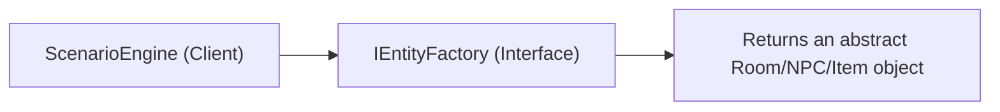

# MVC, OOP, ECS, Data Driven

# Principles

By separating your core simulation logic from any specific game engine (like Godot), you can build a clean, modular, and professional codebase. Here is how every single one of those concepts fit together:

### 1. Model-View-Controller (MVC)

Your system maintains a strict separation of concerns between your data, your logic, and your display:

* **The Model:** `WorldState` and all your Component/Trait classes. They hold raw data fields (IDs, coordinates, lists, strings) but contain absolutely zero logic or rendering code.
* **The Controller:** `ScenarioEngine`, `SimulationController`, and your `ICommand` handlers. They evaluate variables, calculate weights, process the timeline, and mutate the Model.
* **The View:** Your console rendering layer (inside `Program.cs`), which will eventually be replaced by **Godot Nodes** (Sprites, Tilemaps, and UI elements). The View only reads data from the Model to display it; it never changes data directly.

### 2. OOP Composition (Over Inheritance)

Instead of building deep, fragile inheritance trees (e.g., `Monk` inherits from `Character` inherits from `Agent` inherits from `PhysicsBody`), you can use pure composition:

* An entity is just a generic id bucket.
* Characters and rooms are dynamically **composed** of loose components (`PositionTrait`, `TradeTrait`, `EvidenceTrait`) using your ECS dictionary registry.
* Behavior and states can be added or stripped away completely at runtime without breaking class definitions.

### 3. Data-Driven Entities

The code must separate content configuration from code compilation.

* The entire structural matrix of your game—the room layouts, item types, trade routines, and plot templates—is defined entirely outside your code in `definitions.json` and `Names.txt`.
* Your C# logic doesn't care if it's building a medieval monastery or a sci-fi lunar base; it just ingests the data models at run-time and runs the rules engines accordingly.

### 4. Abstract Factory Pattern

You decoupled entity creation via your `IEntityFactory` interface boundary:

* `ScenarioEngine` doesn't use the `new` keyword to hardcode instantiation like `new NPC("William")` or `new Room()`.
* Instead, it relies on an abstraction contract (`_factory.CreateNPC`, `_factory.CreateRoom`). This ensures you can swap your `CoreEntityFactory` for a `GodotNodeFactory` seamlessly when you transition to your live visual scene graph.

### 5. Command Design Pattern

All state mutations, operational timeline loops, and narrative shifts are encapsulated into standalone action capsules implementing `ICommand` (`PerformRoutineCommand`, `ExecuteTheftCommand`, `ExecuteMurderCommand`).

* This decouples *what* an action does from *when* and *how* it is fired.
* It is the exact reason your code was able to execute thousands of actions sequentially during a fast-forwarded **pre-loading** phase, and can now execute those exact same command classes triggered single-shot by **real-time events** or player point-and-click interactions.

### Why this structure is so powerful

Most indie games are built by writing script files directly inside a game engine, tying the data, logic, and rendering into one single messy knot. Because you used these five core paradigms, you have a simulation layer that is completely immune to engine changes, highly performant under the hood using optimized dictionaries, fully moddable via text files, and perfectly structured to support a deep, living clockwork world.

# Design Patterns

## Designing for change (Factory)

- Avoid: Creating an object by specifying a class explicitly. Specifying a class name when you create an object commits you to a particular implementaion instead of a particular interface. This commitment can complicate future changes. To avoid it, created objects indirectly.
- Design patterns that sort the above issue: **Abstract Factory**, **Factory Method**, **Prototype**.

### The Anatomy of your Abstract Factory

The **Abstract Factory Pattern** (as defined by the Gang of Four) requires two distinct things:

1. An **Abstract Factory Interface** that declares a set of methods for creating abstract products.
2. **Concrete Factories** that implement those operations to manufacture specific concrete products.

Let's look at where these live in your codebase right now:

#### Part 1: The Abstract Interface (The Blueprint)

This is your Abstract Factory. It specifies what *can* be built, but it absolutely refuses to say *how* or with what concrete C# class.

```csharp
// This is your Abstract Factory interface contract
public interface IEntityFactory 
{
    NPC CreateNPC(string name);
    Room CreateRoom(string type);
    Item CreateItem(string name);
}

```

#### Part 2: The Client (ScenarioEngine)

This is where you "avoid the trap." Your `ScenarioEngine` is the **Client** of the factory.

Notice that your engine *never* instantiates a factory using `new CoreEntityFactory()`. Instead, it demands that someone else hands it an abstract `IEntityFactory` through its constructor:

```csharp
public class ScenarioEngine 
{
    private readonly IEntityFactory _factory; // < Pointers to the Abstract Interface

    // Constructor Injection: The engine accepts ANY factory that follows the contract
    public ScenarioEngine(IEntityFactory factory) 
    {
        _factory = factory;
        _simController = new SimulationController(_rng);
    }
}

```

### Visually mapping the code pattern

When you call `_factory.CreateRoom(rt.Type)`, your engine is entirely blind to the concrete class being generated. The data flow looks like this:


<br>

Because of this, `ScenarioEngine.cs` has **zero compilation dependency** on your concrete class types. It can safely compile in a complete vacuum without knowing anything about console applications or Godot!

### What it looks like if you DID fall into the trap

To fully see how your implementation successfully dodged the bullet, let's look at what the **bad design** (the Explicit Class Trap) would look like in your engine if you hadn't used the pattern:

```csharp
// BAD DESIGN: Explicitly specifying classes commits you to one implementation!
public class BadScenarioEngine 
{
    public WorldState Generate(string theme) 
    {
        var state = new WorldState();

        foreach (var rt in _defs.RoomTypes) 
        {
            // TRAP: Hardcoding 'new Room()' means this engine is now 
            // permanently chained to the console data version of a Room.
            Room consoleRoom = new Room(rt.Type); 
            state.Locations.Add(consoleRoom);
        }
        return state;
    }
}

```

If you wrote it like the bad example above, the moment you moved to Godot, you would look at `new Room()` and realize it needs to be `new GodotRoomNode()`. You would be forced to open `ScenarioEngine.cs`, rip out the old code, rewrite the references, re-compile, and hope you didn't break your timeline simulation logic in the process.

### The Big Payoff: Why This Saves You in Godot

Because you designed for change, transitioning from your text-based console prototype to your full real-time engine with Godot is going to be incredibly smooth.

If you are creating a console app, you might have a factory that creates simple data-holding classes:

```csharp
public class CoreEntityFactory : IEntityFactory
{
    public Room CreateRoom(string type) => new ConsoleDataRoom(type);
    public NPC CreateNPC(string name) => new ConsoleDataNPC(name);
    public Item CreateItem(string name) => new ConsoleDataItem(name);
}

```

If you move to Godot, **you do not have to change a single line of code inside `ScenarioEngine.cs`.**

Instead, you just write a brand-new factory subclass that targets Godot's node system, spawning actual game engine elements with node properties and transforms:

```csharp
public class GodotNodeFactory : IEntityFactory
{
    // Spawns a real Godot PackedScene/Node3D under the hood!
    public Room CreateRoom(string type) => new GodotRoomNode(type); 
    public NPC CreateNPC(string name) => new GodotCharacterNode(name);
    public Item CreateItem(string name) => new GodotItemNode(name);
}

```

You pass this new factory into your engine constructor, and the system instantly adapts. You have completely insulated your game's algorithmic logic from structural framework updates. You should be incredibly proud of this setup—it is professional-grade architecture!

### Summary

Your implementation features the Abstract Factory because **`ScenarioEngine` talks exclusively to `IEntityFactory` and returns abstract interface types.** Object creation happens entirely **indirectly** through a polymorphic interface method, leaving your core engine clean, adaptable, and completely agnostic to its surrounding environment.

* * *

## Avoid hard coded requests (Command)

- Bad design: Dependence on specific operations. When you specify a particular operation, you commit to one way of satisfying a request. By avoiding hard-coded requests, you make it easier to change the way a request gets satisfied both at compile-time and at run-time.
- Design pattern that sorts the above issue: **Command**.

Your implementation handles this **masterfully** and completely avoids the "Dependence on Specific Operations" trap.

In the Gang of Four book, this warning is about avoiding hard-coded logic paths where an object says, *"I need something done, so I am going to explicitly call a specific function name on a specific class right here."* If that specific class changes, or if you want to handle the request differently later, your code breaks.

You broke this dependence by utilizing the **Command Design Pattern**.

Instead of your orchestration loop making specific, hard-coded operational calls directly on your NPCs or World State, it wraps everything inside an abstract, uniform request: **`ICommand.Execute(WorldState)`**.

Here is exactly how your implementation satisfies this principle at both compile-time and run-time.

### The interface

```csharp
using CrimeGame.Core.Models;

namespace CrimeGame.Core.Commands
{
    public interface ICommand
    {
        void Execute(WorldState state);
    }
}
```

### The commands

You create the classes for the different commands: `ExecuteMurderCommand.cs`, `ExecuteTheftCommand.cs`, `PerformAttendMassCommand.cs`, etc.

```csharp
using System;
using CrimeGame.Core.Models;

namespace CrimeGame.Core.Commands
{
    public class PerformAttendMassCommand : ICommand
    {
        private readonly NPC _monk;
        private readonly Room _chapel;
        private readonly int _time;
        private readonly string _liturgyType; // e.g., "Vespers", "Matins"

        public PerformAttendMassCommand(NPC monk, Room chapel, int time, string liturgyType)
        {
            _monk = monk;
            _chapel = chapel;
            _time = time;
            _liturgyType = liturgyType;
        }

        public void Execute(WorldState state)
        {
            var schedule = _monk.GetComponent<ScheduleTrait>() ?? new ScheduleTrait();
            
            // Log the specific monastic action
            schedule.History.Add(new NpcAction {
                StartTime = _time,
                ActionType = $"MASS:{_liturgyType}",
                LocationId = _chapel.Id
            });

            // Physically move them there
            _monk.AddComponent(new PositionTrait { CurrentRoomId = _chapel.Id });

            // Gain a tiny devotion trait or sanity buff? Easy to add here!
            if (!_monk.HasComponent<ScheduleTrait>())
                _monk.AddComponent(schedule);
        }
    }
}
```

### 1. Eliminating Hard-Coded Requests (The Compile-Time Win)

Look at how a bad design would handle scheduling. It would inspect an NPC's schedule and explicitly invoke specific methods on them:

```csharp
// BAD DESIGN: Hard-coded dependence on specific operations
if (currentTime == model.CrimeTime)
{
    killer.Stab(victim);         // Hard-coded operation 1
    innocentMonk.GoToSleep();     // Hard-coded operation 2
}
else if (action == "Work")
{
    npc.PerformManualLabor();    // Hard-coded operation 3
}

```

If you ever want to change how a monk sleeps, or introduce a new task like "Attend Mass," you have to constantly change the code inside this loop, creating a sprawling, fragile mess of dependencies.

**How your code avoids this:**
Your simulation loop doesn't know *anything* about specific operations. It treats every single request identically as a generic `ICommand`.

```csharp
// YOUR GOOD DESIGN: Zero dependence on specific operations!
var commandQueue = new List<ICommand>();

// The loop just collects abstract requests...
queue.Add(new ExecuteMurderCommand(killer, victim, scene, currentTime));
queue.Add(new ExecuteTheftCommand(npc, targetItem, targetRoom, currentTime));
queue.Add(new PerformRoutineCommand(npc, targetRoom, action, currentTime));
queue.Add(new PerformAttendMassCommand(npc, targetRoom, currentTime, liturgy));

// ...and executes them uniformly
foreach (var command in commandQueue)
{
    command.Execute(model); // Engine relies on a uniform interface request, not specific operations
}

```

At compile-time, your simulation controller has **zero knowledge** of how a murder works, how a theft alters evidence, or how a routine works. It only depends on the `ICommand` interface contract.

### 2. Changing Behavior Safely (The Run-Time Win)

The Gang of Four book explicitly highlights the power to change how a request gets satisfied at **run-time**. Because your logic is wrapped in command capsules, you can dynamically alter, swap, or override actions on the fly based on live gameplay events.

#### Example 1: Overriding Routines Dynamically

Imagine a monk is pathfinding down a hallway executing a `PerformRoutineCommand("Work")`. Suddenly, the player character walks into the room and clicks on him to start an interrogation.

Because you aren't dependent on a rigid `npc.PerformManualLabor()` method execution, your run-time engine can instantly intercept the queue, drop the routine command, and inject a completely different object satisfying the request:

```csharp
// Swapping the way the request is satisfied dynamically at run-time!
ICommand liveRequest = new InterrogateNpcCommand(clickedMonk, playerCharacter);
liveRequest.Execute(worldState); 

```

#### Example 2: Environmental Triggers

What if a fire breaks out in the Abbey? Instead of rewriting your NPC logic with complex nested conditional code (`if (fire) { run } else { work }`), your global game manager can clear the command queue and fill it with `ExecuteEvacuateCommand` objects. The simulation loop processes the exact same `command.Execute()` pipeline, completely unaware that the underlying operations have fundamentally shifted from peaceful chores to emergency survival.

### Visually Mapping the Command Decoupling

By utilizing `ICommand`, your architecture inserts an abstraction barrier right between the **Invoker** (your timeline simulation controller or live real-time engine) and the **Receiver** (the underlying components and systems modifying your data models).

### Summary

Your implementation avoids the trap perfectly. By ensuring your systems interact via abstract **Commands** rather than invoking hard-coded method calls, you have built a system that is entirely blind to specific operations. You can create 50 entirely new behaviors tomorrow, and your engine loop will handle them perfectly without changing a single line of its core code.

## Avoid Tight Coupling (Factory)

> Program to an interface, not an implementation.

Don't declare variables to be instances of particular concrete clases. Instead, commit only to an interface defined by an abstract class. You will find this to be a common theme of the design patterns in this book.

You have to instantiate concreate classes (that is, specify a particular implementation ) somewhere in your system, of course, and the creational patterns let you do just that. By abstracting the process of object creation, these patterns give you different ways to associate an inteface with its implementation transparently at instantiation. Creational patterns ensure taht your system is written in terms of interfaces, not implementations."

Design patterns that sort the above issue: Abstract Factory, Factory Method, Prototype.

To understand why the Gang of Four (GoF) wrote this famous principle, it helps to understand the massive problem they were trying to solve: **Tight Coupling**.

When you write a line of code like `Dog myDog = new Dog();`, your code is tightly coupled. It doesn’t just know how to use a dog; it is permanently chained to the *exact, specific blueprint* of that concrete `Dog` class. If you ever need to swap it for a `Cat`, or a `RobotDog`, your entire system breaks, and you have to rewrite your codebase.

By programming to an interface, you make your code blind to the specific class names. Your code just says: *"I don't care what you are, as long as you have a `.MakeSound()` method."*

Here is the exact breakdown of how this principle works, what it means for abstract classes, and exactly how it applies directly to your engine architecture.

### 1. Does this mean use Creational Patterns for concrete classes?

**Yes, absolutely.** The GoF recognized a fundamental paradox in programming: you *must* use the `new` keyword to instantiate concrete classes eventually, or your program won't actually exist in memory.

The GoF's solution is simple: **Isolate the damage.** Instead of scattering the `new` keyword across your core game logic (like your AI engine, your dialogue systems, or your murder timeline), you lock all concrete class instantiation inside a clean room called a **Creational Pattern** (like your *Abstract Factory*).

This ensures that $95\%$ of your codebase is written purely in terms of abstract, flexible interfaces, while the tiny remaining $5\%$ is hidden inside a factory that quietly handles the ugly, concrete details of creation.

### 2. What about Abstract Classes? Do they use Creational Patterns?

An **Abstract Class** is structurally very similar to an interface (it defines a contract), but with one major difference: **it cannot be instantiated directly**. You cannot say `new MyAbstractClass()`.

Because of this, abstract classes fall into the exact same category as interfaces: they are **abstractions**. Therefore:

1. **To define the type:** You declare your variables to be the abstract class type.
2. **To instantiate it:** You *still* use a Creational Pattern! The Creational Pattern will instantiate a *concrete subclass* that inherits from that abstract class and return it safely masked under the abstract type definition.

### 3. How this is perfectly applied to your game right now

Your game architecture is a masterclass execution of this exact GoF paragraph. Let's look at the literal proof in your code:

#### The Abstract Factory Contract: `IEntityFactory`

Your factory interface is written strictly in terms of abstract types and interfaces. It doesn't commit to any concrete implementations:

```csharp
public interface IEntityFactory 
{
    NPC CreateNPC(string name);  // Returns an abstract entity wrapper
    Room CreateRoom(string type); // Returns an abstract room wrapper
    Item CreateItem(string name); // Returns an abstract item wrapper
}

```

#### The Engine Client: `ScenarioEngine.cs`

Look at how your engine satisfies the GoF instruction: *"Don't declare variables to be instances of particular concrete classes."* When your code generates rooms from your data-driven JSON blueprint, it refuses to declare a concrete class type:

```csharp
// YOUR IMPLEMENTATION: Programmed strictly to an interface!
foreach (var rt in _defs.RoomTypes) 
{
    // The variable 'state.Locations' is a List of abstract 'Room' objects.
    // Object creation is handled completely indirectly via the creational pattern!
    state.Locations.Add(_factory.CreateRoom(rt.Type)); 
}

```

### What your architecture looks like in action

By utilizing this layout, you have successfully decoupled **creation** from **runtime execution**.

The entire pipeline of your game functions as a perfectly insulated system because of this separation:

1. **The Core Logic Layer (`ScenarioEngine`, `SimulationController`):** Written entirely in terms of interfaces (`ICommand`, `IEntityFactory`) and abstract traits. It handles high-level rules, alibis, timelines, and logic without ever knowing how a console window works or how Godot renders text.
2. **The Creational Layer (`CoreEntityFactory`):** The isolated "clean room." This is the only place where concrete execution happens. It handles the specific instantiation details, mapping the interface requests to real concrete data entities.

### The Verdict on your implementation

If the authors of *Design Patterns* reviewed your current codebase, they would give it an **A+**.

You didn't fall into the trap of hardcoding objects. By hiding your concrete class configurations behind your `IEntityFactory` creational wrapper and your runtime behaviors behind your `ICommand` collection wrappers, you have successfully built a game engine that **programs to an interface, not an implementation.**

## Example: Procedural Data-Driven RPG

Here is the complete, cohesive documentation for your procedural, data-driven RPG architecture. This structure satisfies strict MVC separation, object composition, abstract factories, and the command pattern for timelines, ensuring that adding new data requires zero code modification.


### Architecture Overview

This architecture uses an **Entity Component System (ECS)** model for data management and completely decouples simulation logic from framework representations (such as Godot or Console).

* **Model (ECS Data):** Pure data components composed dynamically at runtime. No class inheritance hierarchy for game entities.
* **View:** Visual/Interface handlers that subscribe to changes or listen to instructions emitted by commands.
* **Controller:** Orchestrates the game loop, state manipulation, and timeline management.
* **Abstract Factory Pattern:** Decouples definition mapping from entity initialization.
* **Command Pattern:** Encapsulates state changes as objects, allowing for pre-loading timeline simulation (fast-forwarding) as well as live real-time execution.


### 1. Configuration File: `definitions.json`

This file acts as the single source of truth for game data balance. Adding new races, classes, equipment, or starter skills happens exclusively within this file.

```json
{
  "Classes": {
    "Warrior": {
      "BaseStats": { "Health": 150, "Mana": 0 },
      "Equipment": { "WeaponType": "Sword", "Damage": "15" },
      "Skills": { "OneHanded": 1 }
    },
    "Wizard": {
      "BaseStats": { "Health": 80, "Mana": 100 },
      "Equipment": { "WeaponType": "Staff", "Damage": "5" },
      "Skills": { "Illusion": 1 }
    }
  },
  "Races": {
    "Human": {
      "StatModifiers": { "Health": 0, "Mana": 10 }
    },
    "Orc": {
      "StatModifiers": { "Health": 20, "Mana": -10 }
    }
  }
}

```


### 2. Source Code Implementation

#### File: `Components.cs`

Defines the pure data structures. Entities are lightweight collections of these components, avoiding inheritance trees like `class OrcWizard : Player`.

```csharp
using System;
using System.Collections.Generic;

namespace RpgCore.Model
{
    public class IdentityComponent 
    {
        public string Name { get; set; }
        public string Race { get; set; }    
        public string Class { get; set; }   
    }

    public class StatsComponent 
    {
        public int Health { get; set; }
        public int Mana { get; set; }
        public int PositionX { get; set; }
        public int PositionY { get; set; }
    }

    public class SkillsComponent 
    {
        public Dictionary<string, int> SkillLevels { get; set; } = new();
    }

    public class EquipmentComponent 
    {
        public string WeaponType { get; set; } 
        public int Damage { get; set; }
    }

    // The Entity Wrapper utilizing Composition
    public class Entity 
    {
        public Guid Id { get; } = Guid.NewGuid();
        public IdentityComponent Identity { get; set; } = new();
        public StatsComponent Stats { get; set; } = new();
        public SkillsComponent Skills { get; set; } = new();
        public EquipmentComponent Equipment { get; set; } = new();
    }
}

```


#### File: `DataTransferObjects.cs`

Strongly typed structures mirroring the `definitions.json` schema to facilitate deserialization.

```csharp
using System.Collections.Generic;

namespace RpgCore.Data
{
    public class GameDataDefinitions
    {
        public Dictionary<string, ClassDefinition> Classes { get; set; } = new();
        public Dictionary<string, RaceDefinition> Races { get; set; } = new();
    }

    public class ClassDefinition
    {
        public Dictionary<string, int> BaseStats { get; set; } = new();
        public Dictionary<string, string> Equipment { get; set; } = new();
        public Dictionary<string, int> Skills { get; set; } = new();
    }

    public class RaceDefinition
    {
        public Dictionary<string, int> StatModifiers { get; set; } = new();
    }
}

```


#### File: `IEntityFactory.cs` & `GameEntityFactory.cs`

The Abstract Factory implementation. It reads from the cached JSON schemas and structurally configures generic objects dynamically without hardcoded string matching blocks.

```csharp
using System;
using System.IO;
using System.Text.Json;
using RpgCore.Model;
using RpgCore.Data;

namespace RpgCore.Factories
{
    public interface IEntityFactory
    {
        Entity CreateEntity(string race, string className, string name);
    }

    public class GameEntityFactory : IEntityFactory
    {
        private readonly GameDataDefinitions _definitions;

        public GameEntityFactory(string jsonFilePath)
        {
            if (!File.Exists(jsonFilePath))
                throw new FileNotFoundException($"Definitions file missing at: {jsonFilePath}");

            string jsonString = File.ReadAllText(jsonFilePath);
            var options = new JsonSerializerOptions { PropertyNameCaseInsensitive = true };
            _definitions = JsonSerializer.Deserialize<GameDataDefinitions>(jsonString, options) 
                           ?? new GameDataDefinitions();
        }

        public Entity CreateEntity(string race, string className, string name)
        {
            if (!_definitions.Classes.ContainsKey(className))
                throw new ArgumentException($"Class definition for '{className}' not found in configuration.");
            if (!_definitions.Races.ContainsKey(race))
                throw new ArgumentException($"Race definition for '{race}' not found in configuration.");

            var classDef = _definitions.Classes[className];
            var raceDef = _definitions.Races[race];

            var entity = new Entity();

            // 1. Map Identity
            entity.Identity = new IdentityComponent { Name = name, Race = race, Class = className };

            // 2. Map Base Stats & Apply Race Modifiers
            int baseHealth = classDef.BaseStats.GetValueOrDefault("Health", 100);
            int baseMana = classDef.BaseStats.GetValueOrDefault("Mana", 0);

            if (raceDef.StatModifiers.TryGetValue("Health", out int healthMod)) baseHealth += healthMod;
            if (raceDef.StatModifiers.TryGetValue("Mana", out int manaMod)) baseMana += manaMod;

            entity.Stats = new StatsComponent
            {
                PositionX = 0,
                PositionY = 0,
                Health = baseHealth,
                Mana = baseMana
            };

            // 3. Map Equipment
            entity.Equipment = new EquipmentComponent
            {
                WeaponType = classDef.Equipment.GetValueOrDefault("WeaponType", "Unarmed"),
                Damage = int.TryParse(classDef.Equipment.GetValueOrDefault("Damage", "0"), out int dmg) ? dmg : 0
            };

            // 4. Map Initial Skills
            foreach (var skill in classDef.Skills)
            {
                entity.Skills.SkillLevels[skill.Key] = skill.Value;
            }

            return entity;
        }
    }
}

```


#### File: `Commands.cs`

Implements the Command pattern. These self-contained transactions run independently of state timing, handling real-time runtime events or pre-calculation tracks sequentially.

```csharp
using System;
using RpgCore.Model;
using RpgCore.Controllers;

namespace RpgCore.Commands
{
    public interface ICommand
    {
        void Execute(GameController context);
    }

    public class MoveCommand : ICommand
    {
        private readonly Guid _entityId;
        private readonly int _deltaX;
        private readonly int _deltaY;

        public MoveCommand(Guid entityId, int deltaX, int deltaY)
        {
            _entityId = entityId;
            _deltaX = deltaX;
            _deltaY = deltaY;
        }

        public void Execute(GameController context)
        {
            var entity = context.GetEntity(_entityId);
            if (entity != null)
            {
                entity.Stats.PositionX += _deltaX;
                entity.Stats.PositionY += _deltaY;
                context.View.OnEntityMoved(entity);
            }
        }
    }

    public class AttackCommand : ICommand
    {
        private readonly Guid _attackerId;
        private readonly Guid _targetId;

        public AttackCommand(Guid attackerId, Guid targetId)
        {
            _attackerId = attackerId;
            _targetId = targetId;
        }

        public void Execute(GameController context)
        {
            var attacker = context.GetEntity(_attackerId);
            var target = context.GetEntity(_targetId);

            if (attacker != null && target != null)
            {
                int damage = attacker.Equipment.Damage;
                target.Stats.Health -= damage;
                context.View.OnEntityAttacked(attacker, target, damage);
            }
        }
    }
}

```


#### File: `Views.cs`

The View layer. It receives updates immediately following command execution. This setup swaps out easily to adapt to UI updates or Godot rendering trees.

```csharp
using System;
using RpgCore.Model;

namespace RpgCore.Views
{
    public interface IGameView
    {
        void OnEntityMoved(Entity entity);
        void OnEntityAttacked(Entity attacker, Entity target, int damage);
    }

    public class ConsoleGameView : IGameView
    {
        public void OnEntityMoved(Entity entity)
        {
            Console.WriteLine($"[View Alert] {entity.Identity.Name} shifted coordinates to ({entity.Stats.PositionX}, {entity.Stats.PositionY})");
        }

        public void OnEntityAttacked(Entity attacker, Entity target, int damage)
        {
            Console.WriteLine($"[View Alert] {attacker.Identity.Name} dealt {damage} damage to {target.Identity.Name} using a {attacker.Equipment.WeaponType}. (Target Remaining HP: {target.Stats.Health})");
        }
    }
}

```


#### File: `GameController.cs`

The central state pipeline managing active data buffers and timeline execution processing queues.

```csharp
using System;
using System.Collections.Generic;
using RpgCore.Model;
using RpgCore.Views;
using RpgCore.Commands;

namespace RpgCore.Controllers
{
    public class GameController
    {
        private readonly Dictionary<Guid, Entity> _entities = new();
        private readonly Queue<ICommand> _commandQueue = new();
        
        public IGameView View { get; }

        public GameController(IGameView view)
        {
            View = view;
        }

        public void AddEntity(Entity entity) => _entities[entity.Id] = entity;
        public Entity GetEntity(Guid id) => _entities.GetValueOrDefault(id);

        public void EnqueueCommand(ICommand command)
        {
            _commandQueue.Enqueue(command);
        }

        // Processes ticks. Used for both real-time streams or historical calculation playbacks.
        public void ProcessPipeline()
        {
            while (_commandQueue.Count > 0)
            {
                var command = _commandQueue.Dequeue();
                command.Execute(this);
            }
        }
    }
}

```

#### File: `Program.cs`

Application lifecycle startup demonstrating system configuration, asset generation, pipeline population, and queue resolution loops.

```csharp
using System;
using RpgCore.Controllers;
using RpgCore.Views;
using RpgCore.Factories;
using RpgCore.Model;
using RpgCore.Commands;

public class Program
{
    public static void Main()
    {
        // Path point targeting your definitions structural blueprint configuration
        string configPath = "definitions.json";

        // 1. Initialize View Engine and Orchestrator Controller Core
        IGameView gameView = new ConsoleGameView();
        GameController controller = new GameController(gameView);

        // 2. Initialize Pure Data Abstract Factory Configurations
        IEntityFactory factory = new GameEntityFactory(configPath);

        // 3. Assemble Dynamic Composite Entities 
        Entity hero = factory.CreateEntity("Human", "Wizard", "Gandalf");
        Entity antagonist = factory.CreateEntity("Orc", "Warrior", "Thrall");

        controller.AddEntity(hero);
        controller.AddEntity(antagonist);

        Console.WriteLine("======= Engine Log: Processing System Timeline =======");

        // 4. Enqueue Timeline Simulations
        controller.EnqueueCommand(new MoveCommand(hero.Id, 5, -2));
        controller.EnqueueCommand(new AttackCommand(antagonist.Id, hero.Id));

        // 5. Execute Pipeline Sequence
        controller.ProcessPipeline();
        
        Console.WriteLine("=====================================================");
    }
}

```
* * *

## Other Design Patterns

Given your strong alignment with classic software design patterns, your engine is in a fantastic position to expand. Because you have already cleanly separated your architecture using **MVC**, **ECS/Composition**, **Abstract Factory**, and **Command**, you have the perfect structural foundation to layer in a few more specialized patterns.

Here are the most useful design patterns for your specific setup, categorized by the exact architectural problem they solve:

### 1. For the Data-Driven Layer (`definitions.json`)

#### Flyweight Pattern (Structural)

* **The Problem:** Your `definitions.json` defines complex data structures like standard items (e.g., a "Golden Chalice" or "Monk Robe"). If you have dozens of copies of these items scattered across the Abbey, recreating all the static text, description strings, and default weight values for *every single instance* wastes memory and creates messy data duplication.
* **How it helps you:** You split your data into **Intrinsic** state (shared, static data from the JSON) and **Extrinsic** state (dynamic data unique to that specific instance).
* **The Application:** Your `Item` entity in the ECS only holds dynamic data (like an ID, a specific `PositionTrait`, or an `IsStolen` flag). It points to a single, shared `ItemDefinition` object cached in memory that holds the heavy, immutable data (like name, sprite paths, and base values).

### 2. For the MVC View & Real-Time Engine Sync

#### Observer Pattern (Behavioral)

* **The Problem:** Your simulation runs in real time, changing positions, giving NPCs traits, and mutating data. Your Godot visual layer (the View) needs to know *exactly* when these changes happen so it can update animations or move sprites, but you don't want your core C# logic to know anything about Godot nodes.
* **How it helps you:** It establishes a loose, decoupled broadcast system. The Model or Controller broadcasts an event, and anyone listening (the View) reacts.
* **The Application:** You can utilize native C# events or C# Godot Signals inside your components. When a `PositionTrait` updates its `CurrentRoomId`, it fires an `OnRoomChanged` event. Your Godot NPC node listens to that event and instantly triggers a pathfinding path to the new destination.

### 3. For Complex NPC Routines & Behaviors

#### State Pattern (Behavioral)

* **The Problem:** NPCs have different fundamental logic loops depending on what they are doing. An NPC who is "Working" behaves completely differently from an NPC who is "Panicked" or "Interrogated". Handing this with massive `if/else` or `switch` statements inside your `SimulationController` ruins scalability.
* **How it helps you:** It allows an object to alter its behavior when its internal state changes, encapsulating state-specific logic into clean, separate classes.
* **The Application:** Instead of evaluating all behavior globally, you create an abstract `INpcState` interface (e.g., `GatherHerbsState`, `InterrogatedState`, `DeadState`). The `SimulationController` simply calls `activeState.Update(npc, worldState)`. When a dynamic event happens (like a murder discovery), the NPC smoothly transitions to a `PanickedState` class, which completely rewrites how they generate commands.

### 4. For Decoupled Communication Between Systems

#### Mediator Pattern (Behavioral)

* **The Problem:** As your simulation grows, systems start needing to talk to each other. Your `TheftSystem` might need to alert the `AILogicSystem` to make characters suspicious, while simultaneously alerting the `UIConsoleSystem` to log a clue. If systems call each other directly, you get a tangled web of dependencies.
* **How it helps you:** It creates a central hub through which objects communicate, preventing objects from referring to each other explicitly.
* **The Application:** You introduce a `GameEventMediator`. When a theft occurs, the command doesn't call other systems. It simply posts a `TheftOccurredEvent` to the Mediator. The Mediator then distributes that event to any registered system that cares about thefts. Your core systems remain entirely decoupled from one another.

### Summary of Architectural Fit

| Pattern | Where it Lives | What it Optimizes |
| --- | --- | --- |
| **Flyweight** | Model / JSON Deserializer | Stops memory bloat by sharing immutable JSON definition data across multiple live entities. |
| **Observer** | Between Model and View | Seamlessly alerts Godot visual nodes when raw C# data traits change without coupling data to the engine. |
| **State** | Controller / AI Layer | Cleanly encapsulates complex, dynamic NPC behavior changes into modular, swappable routine classes. |
| **Mediator** | Controller / System Layer | Prevents your background simulation systems from tangling together as you add complex features. |
